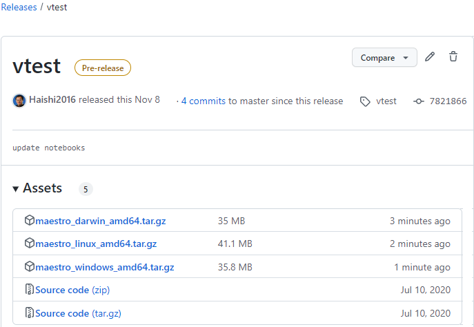

<!--
Copyright (c) Microsoft Corporation.
Licensed under the MIT license.
SPDX-License-Identifier: MIT
-->
# Build up CLI and release

_(last edit: 10/24/2024)_

To build up Maestro CLI and release with Symphony API and samples.
The build uses mage to automate the process. Please refer to  [Build CLI](../docs/symphony-book/cli/build_cli.md) if manual steps are preferred.

## Prerequisites
1. If you are doing this from WSL/Ubuntu, install `zip`.

   ```bash
   sudo apt-get install zip unzip -y
   ```
2. Update maestro version.

   Update the `SymphonyAPIVersion` constant under `cli/cmd/up.go` to reflect the latest Symphony version.

## Mage Commands
See all commands with mage -l
```
# under symphony/cli folder
> mage -l
Use this tool to quickly build symphony API or maestro CLI. It can also help generate the release package.

Targets:
  buildApi            Build Symphony API for Windows, Mac and Linux.
  buildCli            Build maestro CLI tools for Windows, Mac and Linux.
  generatePackages    Generate packages with Symphony API, maestro CLI and samples for Windows, Mac and Linux.
```
Samples
```
# under symphony/cli folder
# Build up Symphony API for Windows, Mac and Linux. You can find the binary files in symphony/api folder
mage buildApi

# Build up Maestro CLI for Windows, Mac and Linux. You can find the binary files in symphony/cli folder
mage buildCli

# Build up Symphony API and Maestro CLI for Windows, Mac and Linux. Copy the binary files, samples and configuration files to the specified folder and generate the release package. You will find maestro_windows_amd64.zip, maestro_darwin_amd64.tar.gz and maestro_linux_amd64.tar.gz in the specified folder.
mage generatePackages /home/usr/assemble
```

## Release 

1. Edit your release to include the three **.gz** files from the previous step:

   

1. Check `symphony/cli/install/install.sh` and `symphony/cli/install/install.ps1` to a public repository. Users will be instructed to use scripts from this repo for the one-command experience, for example:

   ```bash
   wget -q https://raw.githubusercontent.com/eclipse-symphony/symphony/master/cli/install/install.sh -O - | /bin/bash
   ```