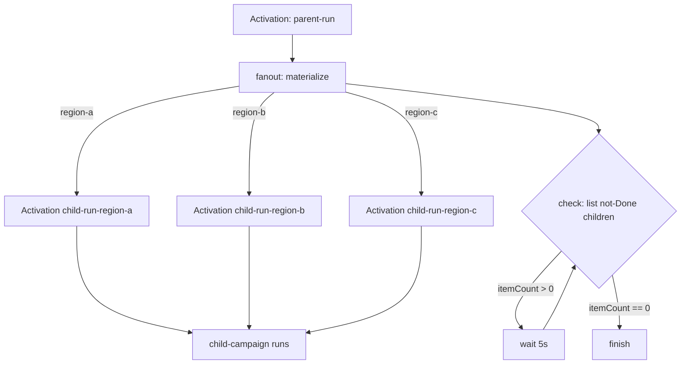

# Campaign fan-out: one campaign activating many child campaigns

This sample shows how a **parent campaign** can activate **many child campaigns**
in parallel, wait for all of them to finish, and only then continue.

It exercises the three extensions added for cross-campaign orchestration:

1. **`materialize` stage provider** can create **Activation** objects from a
   `CatalogVersion` whose `catalogType` is `activation`. When the stage fans out
   (via the stage `contexts` field), the provider creates one child Activation per
   fan-out value, appends that value to the child Activation name, and injects it
   into the child Activation's `spec.inputs.context`.
2. **`list` stage provider** can list **Activation** objects and supports a
   **general, field-based filter** (works for any object type). Filters are matched
   against JSON dot-paths such as `metadata.labels.parentActivation` or
   `status.status`, with operators `eq` (default), `ne`, `contains`, `exists`.
3. The **parent campaign** uses `contexts` to fan out, then loops on a `list` +
   `wait` pair until every child Activation reaches the `Done` state (`9996`).

## Files

| File | What it is |
|------|------------|
| `child-campaign.yaml` | The child campaign (a trivial mock stage that completes immediately). |
| `child-activation-catalog.yaml` | A `Catalog`/`CatalogVersion` with `catalogType: activation` whose properties embed the child Activation spec. The parent materializes this. |
| `parent-campaign.yaml` | The parent campaign: `fanout` (materialize) → `check` (list) → `wait` → `finish`. |
| `activation.yaml` | Root Activation that starts the parent campaign. |

## How it flows



The `check` stage lists Activation objects filtered to:

- `metadata.labels.parentActivation == <this parent activation>` and
- `status.status != 9996` (i.e. **not** `Done`).

`itemCount` is therefore the number of children still running. When it hits `0`,
the parent advances to `finish`. Replace `finish` with another `materialize` stage
to chain into yet another campaign.

## Run it on a cluster

Apply in this order (children first so they exist when the parent activates them):

```bash
kubectl apply -f child-campaign.yaml
kubectl apply -f child-activation-catalog.yaml
kubectl apply -f parent-campaign.yaml
# start the run
kubectl apply -f activation.yaml
```

Watch it progress:

```bash
kubectl get activations
kubectl get activation parent-run -o yaml        # parent status / stage history
kubectl get activations -l parentActivation=parent-run   # the child activations
```

You should see three child activations (`child-run-region-a`, `child-run-region-b`,
`child-run-region-c`) appear, move to `Done`, and then the parent activation move to
its `finish` stage.

## Test it locally (unit tests)

The provider logic is covered by Go unit tests that do not need a cluster:

```bash
cd api
go test ./pkg/apis/v1alpha1/providers/stage/materialize/... \
        ./pkg/apis/v1alpha1/providers/stage/list/...
```

Relevant tests:

- `TestMaterializeActivations` / `TestMaterializeActivationFanout` — materialize creates
  child activations and fans out (name suffix + `spec.inputs.context`).
- `TestListProcessActivations*` — list returns activations and applies single / multiple /
  `exists` filters.
