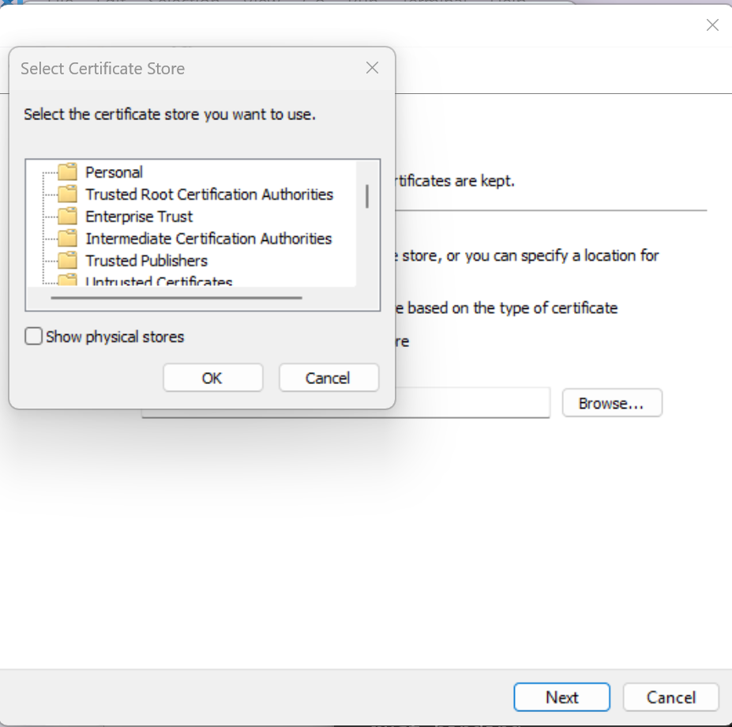

# Retail Scenario

Before start, please [set up your own kubernetes cluster](https://kubernetes.io/docs/setup/) OR follow the [instruction](../../../test/localenv/README.md) to set up minikube to run symphony. **We recommend the second method since it's easier.**

## Build UWP sample app (in Windows)
### Step1: Build App Package
   1. **Download Visual Studio 2022 with Windows Kits**
   
   2. **Open `ContosoCafeteriaKiosk/ContosoCafeteriaKiosk.sln` with Visual Studio 2022**
      1. **Build x64 architecture, `Debug` profile**
          1. Right-click "Solution 'ContosoCafeteriaKiosk'" then click "Configuration Manager"
          2. Set Configuration as x64 and Platform as Debug, then click "Close"
              
          3. Right-click "Solution 'ContosoCafeteriaKiosk'" then click "Build Solution"
      2. **Build x86 architecture, `Debug` profile** (same as x64 except set Configuration as x86)
   3.  **Publish App Package**
      1. Right-click "ContosoCafeteriaKiosk (Universal Windows)" -> then click "Publish" -> then click "Create App Packages"
      2. Follow this instruction:[Create an App Installer file with Visual Studio](https://learn.microsoft.com/en-us/windows/msix/app-installer/create-appinstallerfile-vs) 
      (Select Packages only x86 and x64)
      
   4. **Create Succeeded**
   Remember the **Output location** you choose.

### Step 2: Trust Certificate Generated in App Package
1. Double-click the `.cer` file(like ContosoCafeteriaKiosk_1.0.3.0_x86_x64_Debug.cer)

2. Click "Install Certificate" -> Click "Local Machine" -> Click "Next" -> Click "Place all certificates in the following store" -> Click "Browse" -> Click "Trust Root Certification Authorities" -> Click "Ok" -> Click "Next" -> Click "Finish"

## Set Development Environment

### Step 1: Computer Setup

1. Search for "For developer" in the Windows search bar
2. Turn on **Developer Mode**, **Device Portal**, and **Device Discovery**
3. Restart your PC to ensure it takes effect


### Step 2: Get IP and PIN

1. Click "Device Portal" -> Find this **IP**
    
2. Click "Device Discovery" -> Click "Pair"
   Then you will get the **PIN**
   

## Set Up YAML Configuration

1. Update `docs\samples\retail\templates\solution.yaml` 
    Find component `kiosk` -> update `properties.app.package.path` 
    
    ```
    - name: kiosk
        constraints: ${{$equal($property(location), 'windows')}}
        type: win10.sideload
        properties:
          app.package.path:<ContosoCafeteriaKiosk_1.0.3.0_x86_x64_Debug.appxbundle full path>
        <!-- Please note that you need to change the path format from single backslashes to double backslashes in the `solution.yaml` file. 
        For example, change the path from:"C:\demo3\ContosoCafeteriaKiosk_1.0.3.0_Debug_Test\ContosoCafeteriaKiosk_1.0.3.0_x86_x64_Debug.appxbundle" to "C:\demo3\ContosoCafeteriaKiosk_1.0.3.0_Debug_Test\ContosoCafeteriaKiosk_1.0.3.0_x86_x64_Debug.appxbundle" -->
    ```
2. Change `remote-agent\bootstrap\topologies.json`:
    1. Find `winAppDeployCmdPath` by opening "C:\\Program Files (x86)\\Windows Kits\\10\\bin", find a kit version and click x64, -> get the `WinAppDeployCmd.exe` location
        
    2. Change `ipAddress` to your IP and `pin` to your PIN
        ```
        {
          "provider": "providers.target.win10.sideload",
          "role": "win10.sideload",
          "config": 
          {
            "name": "sideload",
            "winAppDeployCmdPath": (Your WinAppDeployCmd.exe location),
            "ipAddress": (Your IP),
            "pin": (Your PIN)
          }
        },
        <!-- Please note that you need to change the path format from single backslashes to double backslashes in the `topologies.json` file. >
        ```
## Start Symphony (in WSL)

1. Start minikube cluster
    ```
    minikube start
    ```
2. Sign Your Client Public Key with Symphony:
    1. Generate client cert.
    ```
    sudo apt update
    sudo apt install openssl

    # create a local CA
    openssl genrsa -out ca.key 2048
    openssl req -new -x509 -days 3650 -key ca.key -out ca.crt -subj "/CN=MyLocalCA" 

    # create a client key and CSR
    openssl genrsa -out client.key 2048
    openssl req -new -key client.key -out client.csr -subj "/CN=target.symphony.microsoft.com"

    # use ca to sign 
    openssl x509 -req -in client.csr -CA ca.crt -CAkey ca.key -CAcreateserial -out client.crt -days 365 -sha256
    # verify the client certificate
    openssl verify -CAfile ca.crt client.crt
    # (option)For windows Client You need to generate a .pfx from client cert
    openssl pkcs12 -export -out client.pfx -inkey client.key -in client.crt -certfile ca.crt
    ```
    2. Create Secret:
    ```
    # create a client cert secret: secret name is client-cert-secret, key is client-cert-key, value is client.crt
    kubectl create namespace cert-manager
    kubectl create secret generic client-cert-secret --from-file=client-cert-key=ca.crt -n cert-manager
    ```
    Check Secret
    ```
    kubectl get secret
    ```
    Your should find the secret ：
    ```
    NAMESPACE      NAME                                    TYPE                            DATA   AGE
    cert-manager   client-cert-secret                      Opaque                          1      3h23m
    ```

2. Update parameter
    1. Start Symphony
    ```
    mage cluster:deployWithSettings "--set remoteAgent.remoteCert.used=true --set remoteCert.remoteCAs.secretName=client-cert-secret --set remoteCert.remoteCAs.secretKey=client-cert-key  --set remoteCert.remoteCAs.secretKey=client-cert-key --set installServiceExt=true" 
    ```
    If you are using MiniKube, please run `minikube tunnel` in a single terminal windows and keep it open for the rest steps.
    You need to run minikube tunnel after minikube start and before mage cluster:deployWithSettings done
    ```bash
    minikube tunnel
    ```
## Get Server cert From Symphony
  Get localCA.crt from symphony server
  ```bash
  # Get the server CA certificate and store in docs/samples/retail/templates
  kubectl get secret -n default symphony-api-serving-cert  -o jsonpath="{['data']['ca\.crt']}" | base64 --decode > localCA.crt
  ```
### Trust Server Cert(For windows)
  Find the localCA.crt -> Double click the crt -> Install Certificate -> Store Location: Local Machine -> following following image instruction -> finished
  
### Modify host file(For windows): 
  edit this file with notepad:C:\Windows\System32\drivers\etc\hosts
  Add this line:
  ```
  127.0.0.1       symphony-service
  ```
## Remote Agent Bootstrap
  Apply remote agent target
  ```bash
  kubectl apply -f docs/samples/retail/templates/remote-target-win10.yaml
  ```
  For windows Client You need to generate a .pfx from client cert (templates\client-cert.pem and templates\client-key.pem)
  ```
  # You can use openssl command
  openssl pkcs12 -export -out client.pfx -inkey client-key.pem -in client-cert.pem
  ```

  Run bootstrap ps1
  ```bash
  # Set your pfx password as security password
  HTTP
  .\bootstrap.ps1 -endpoint https://symphony-service:8081/v1alpha2 -cert_path .\client.pfx -target_name windows-target -namespace default -topology topologies.json -run_mode 'schedule'
  ```
  wait for remote-target ready
  ```bash
  kubectl get target
  ```
  apply k8s target
  ```bash
  kubectl apply -f docs/samples/retail/templates/k8s-target.yaml
  ```
  wait for k8s-target ready
  ```bash
  kubectl get target
  ```
  Apply solution and instance
  ```bash
  kubectl apply -f docs/samples/retail/templates/solution.yaml
  kubectl apply -f docs/samples/retail/templates/instance.yaml
  ```
  Check result:
  search ContosoCafeteriaKiosk -> app installed
  ```bash
  kubectl get instance
  kubectl get ingress -> nginx
  kubectl get deployment ->retail-backend / database
  ```
   Once deployment is complete, you should see a `retail-backend` deployment in your deployment list. 

  ```bash
  kubectl get deployment
  NAME                                     READY   UP-TO-DATE   AVAILABLE   AGE
  database                                 1/1     1            1           67s
  nginx-ingress-ingress-nginx-controller   1/1     1            1           102s
  retail-backend                           1/1     1            1           47s
  ...
  ```
