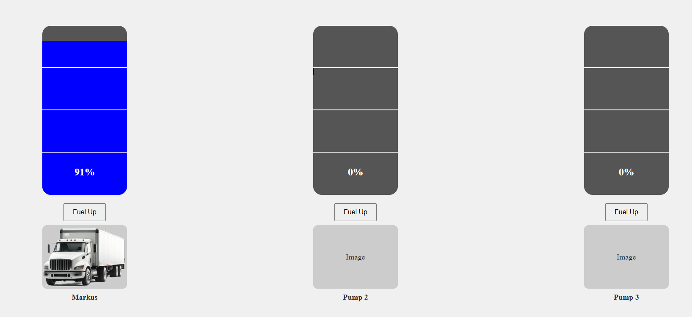

# Setup Fuel Pump


## Local Development

```
cd ~/maestro  #change to repo root
sudo apt-get install -y python3-pip python3-venv
python3 -m venv fuel-pump-env
source fuel-pump-env/bin/activate
pip install -r ./docker/fuel-pump/requirements.txt
mkdir -p ./fuel-pump-env/app
cp ./docker/fuel-pump/fuel-pump.py fuel-pump-env/app/main.py
cd fuel-pump-env/app/
uvicorn main:app --host 0.0.0.0 --port 8000
```

## Build Container

```
docker build -t fuelpump:1.0 -f docker/fuel-pump/dockerfile .
docker run -p 8000:8000 fuelpump:1.0
```

## API Documentation

After the docker container is started, the webpage is available at http://localhost:8000/



The API exposes the following endpoints:

- Endpoint for docking a new truck to the pump station:
http://localhost:8000/dock \
Example:
```
curl --location 'http://localhost:8000/dock' \
--header 'Content-Type: application/json' \
--data '{
    "current_fuel": 1,
    "name": "Markus",
    "image" : "https://github.com/eclipse-symphony/symphony/blob/sdv-hackathon-portal/docs/samples/opera/public/box-truck.png?raw=true"
}'
```

- Endpoint for getting the truck details at a specific pump:
http://localhost:8000/pump_truck \
Example:
```
curl --location 'http://localhost:8000/pump_truck?pump=1'
```

- Endpoint for getting the current fuel level of a truck by name:
http://localhost:8000/fuel \
Example:
```
curl --location 'http://localhost:8000/fuel' \
--header 'Content-Type: application/json' \
--data '{
    "name": "Markus"
}
```

- Endpoint for undocking a truck from the pump station:
http://localhost:8000/undock \
Example:
```
curl --location 'http://localhost:8000/undock' \
--header 'Content-Type: application/json' \
--data '{
    "name": "Markus"
}'
```

- Endpoint for starting the fueling process at a pump:
http://localhost:8000/start_fueling \
Example:
```
curl --location 'http://localhost:8000/start_fueling?pump=1' \
--header 'Content-Type: application/json' \
--data '{
    "current_fuel": 1,
    "name": "Markus",
    "image" : "https://github.com/eclipse-symphony/symphony/blob/sdv-hackathon-portal/docs/samples/opera/public/box-truck.png?raw=true"
}'
```