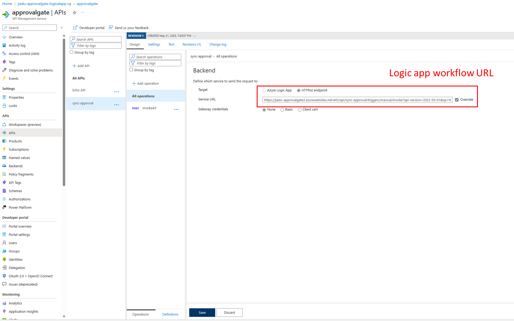
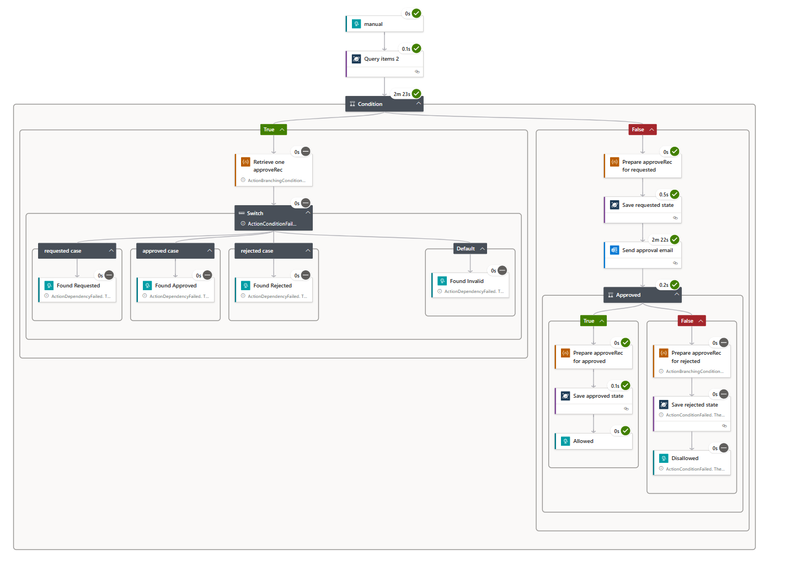
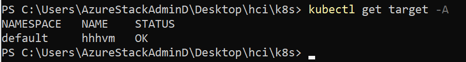
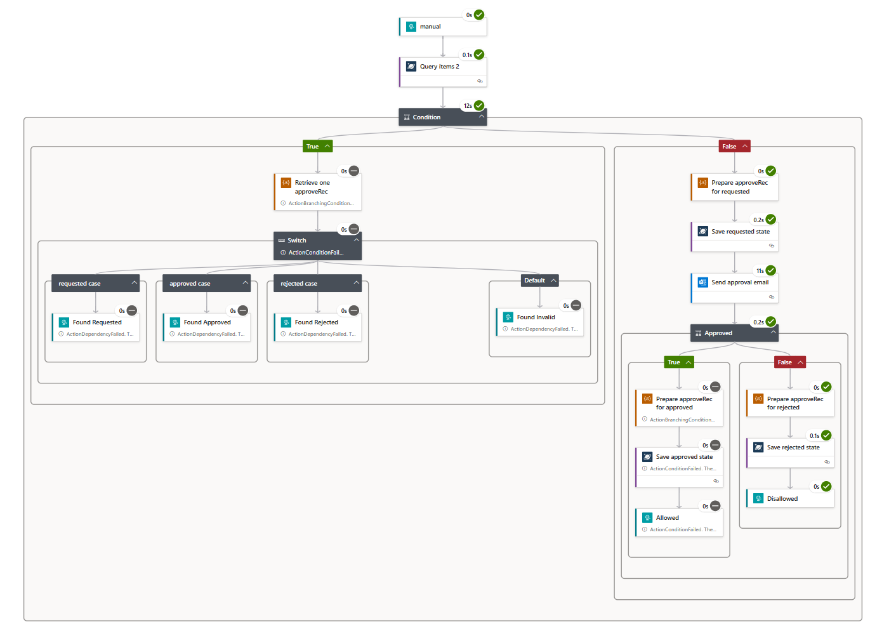
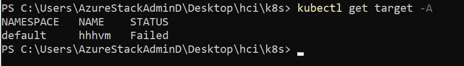
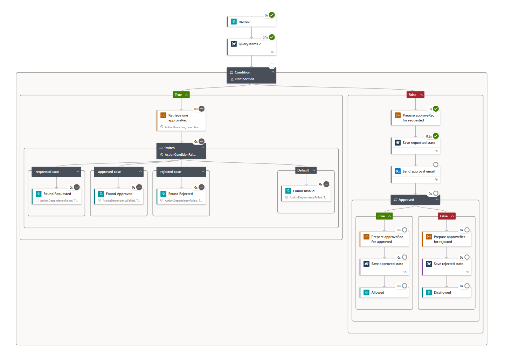
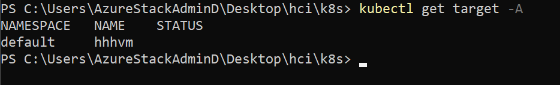
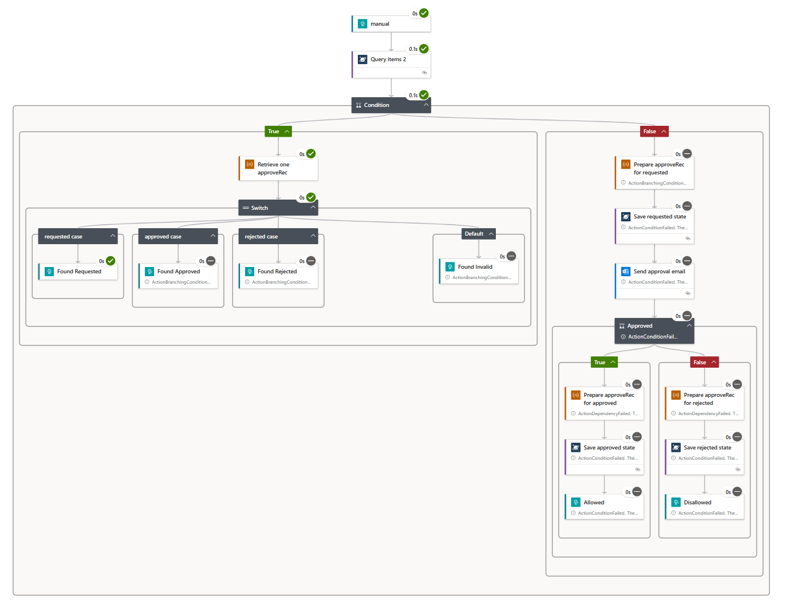

# Add approval gate to Target resource

Symphony allows to define multiple components in Target resource and provides a workflow based on dependencies. Leveraging this, we could add approval gate to Target resource.

In this document, you will get,
1. How to use Azure Logic app and Azure API Management service to establish an approval gate.
2. How to leverage HTTP provider to add approval gate to existing target resource.
3. Examples of using approval gate in VM Target resource

## Write your approval gate
[Azure Logic Apps](https://learn.microsoft.com/en-us/azure/logic-apps/logic-apps-overview) is a cloud platform where you can create and run automated workflows with little to no code. Leveraging logic app, you could quickly establish a approval workflow.

### Step 1: Preparation

1. Create a standard workflow: https://learn.microsoft.com/en-us/azure/logic-apps/create-single-tenant-workflows-azure-portal?tabs=standard
2. Create a cosmos db account: https://learn.microsoft.com/en-us/azure/cosmos-db/nosql/quickstart-portal#create-account

We will define the approval workflow in Standard Logic app, and save the approve records in Azure Cosmos DB.

### Step 2: Define your approval flow

The approval flow is like this,

1.  Check the Cosmos DB record, if a record exists that shows approved or rejected, return result accordingly. If the record shows "requested", return false to stop the deployment (for the current reconciliation).
2.	Create a new record with a "requested" state. Send an email to the approver.
3.	Based on approver’s action, upsert the Cosmos DB record to reflect approver's choice.

Here is an example of approval flow: [ApprovalLogicApp.json](ApprovalLogicApp.json)


### Step 3 (optional): Create APIM (Azure API Management service) to manage your logic app API.

API Management (APIM) is a way to create consistent and modern API gateways for existing back-end services. API Management helps organizations publish APIs to external, partner, and internal developers to unlock the potential of their data and services.

To import Standard logic app into Azure API Management: https://techcommunity.microsoft.com/t5/azure-paas-blog/import-logic-apps-standard-into-azure-api-management/ba-p/3055490

Leveraging APIM, you could manage your Logic app API and also hide the access key of Logic app in backend pool.

FrontEnd setting:


BackEnd setting:


## Add approval gate in your target resource

```yaml
apiVersion: fabric.symphony/v1
kind: Target
metadata:
  name: yourtarget
spec:
  components:
  - name: yourtarget-gate
    type: gate
    properties:
      http.url: "<APIM FrontEnd URL>"
      http.method: "POST"
      http.body: "{\"id\": \"<OperationId>\", \"operation\": \"<Operation>\", \"target\": \"yourtarget\"}"
  - name: yourtarget
    type: virtualmachine
    properties:
      ...
    dependencies:
    - yourtarget-gate
  topologies:
  - bindings:
    - role: gate
      provider: providers.target.http
    - role: virtualmachine
      provider: providers.target.mqtt
      config:
        ...
```

Besides the existing component, add a component called "yourtarget-gate" which binds with HTTP provider. And yourtarget has the dependencies on the approval gate component - "yourtarget-gate".

Parameters needs to fill in:
|Placeholder|Description|
|-----------|-----------|
|APIM FrontEnd URL|The frontend url in APIM|
|OperationId|Unique id of this operation, OperationId will be used as the identifier for approval record|
|Operation|The operation to yourtarget|

## Examples of using approval gate in VM Target resource

### Approved
Approval workflow:

VM Target resource:


### Rejected
Approval workflow:

VM Target resource:


### Requested (pending approval)
Approval workflow:

VM Target resource:


> Repeated approval request:
Approval workflow:
