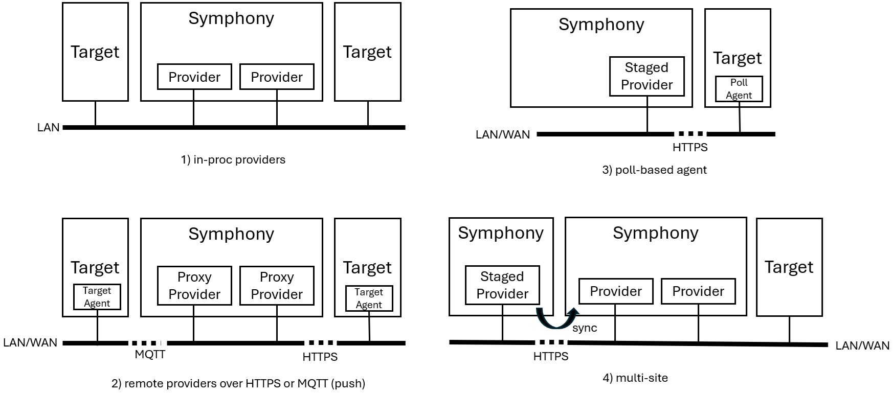

# Symphony agents

_(last edit: 6/4/2024)_

Symphony doesn’t mandate an agent to be installed on the targets it manages. Symphony prefers remote management interfaces when possible. On the other hand, if a target doesn’t support a remote management interface, a Symphony agent can be installed on the target so that Symphony control plane can manage it.

Symphony has four types of agents: Symphony agent, Symphony target agent, Symphony poll agent, and a lightweight Symphony poll agent (code name Piccolo), as summarized in the following table:

| Agent Type | Protocol | Summary |
|--------|--------|--------|
| Lightweight poll agent | HTTPS (outbound) | Polls and applies target desired state |
| Poll agent | HTTPS (outbound) | Polls and applies target desired state |
| Target agent | MQTT or HTTPS (inbound) | Control plane pushes desired state |
| Symphony agent | N/A | Runs on a target to provide additional functionalities1 |

1: The Symphony agent provides additional features to a target, such as the ability to take camera snapshots. This agent has nothing to do with the [state seeking](../concepts/state_seeking.md) process, nor the different deployment topologies.

> **NOTE:** Except for Piccolo, you can also combine agents into a combined agent, such as a Poll agent + Target agent.

## Symphony Deployment Topologies

Symphony supports several different deployment topologies to accommodate different requirements, as summarized by the following diagram.

### In-proc providers (without separate agents)
By default, all Symphony target providers are loaded into the Symphony API process. This means that all providers are invoked through direct in-process calls. The provider in turn uses APIs from corresponding toolchains to interact with the underlying systems. For example, when a Kubernetes target provider is used, the provider is invoked in-process in the Symphony API process and uses a Kubernetes client to interact with the Kubernetes API server (either on the same cluster or on a different cluster). 
### Proxy providers (with target agents)
In some cases, you may want to run the target providers in a separate process. For example, when you need to manage a target on a different network, you may want to use a proxy provider to interact with the remote target. In this case, targe providers will be loaded and executed on a separate Symphony agent. 
Symphony control plane communicates with these Symphony agents through either HTTP or MQTT. In the case of HTTP, the Symphony agent needs to host a Web server that exposes the expected HTTP endpoints; in the case of MQTT, the Symphony agent and the Symphony control plane are connected to a shared MQTT broker.
Running target providers in a separate agent has several advantages:
1.  Fine-granular access control. Instead of granting Symphony API with access to all managed systems, you can isolate different systems into separate Symphony agents and assign minimum required accesses. 
2.  If needed, you can implement your own agent from the ground up with any programming language of your choice. Or you can use the default Symphony agent implementation that supports both HTTP and MQTT protocol. A custom agent implementation can be used in scenarios where you need specific programming languages (such as certified Rust versions) or implementations.
3.  Support different network topologies. For example, if you manage a remote target that can’t be directly reached, you can use a MQTT proxy to bridge connection between the control plane and the target through outbound connections. 
 ### Poll-based agents
The proxy providers above use a “push” mode, in which the desired state is pushed to the target agents. In cases where inbound connections are impossible, you can use poll-based agents that communicate with the control plane through a single outbound connection. These agents periodically poll the control plane for the new desired state and apply the state to local targets. 
Symphony provides two poll-based agents: a full-scale agent that supports all Symphony target provider types, and a light-weight agent (Piccolo) that supports deploying Web Assemblies and eBPF modules only.  The light-weight agent is less than 4MB in size, so it’s suitable for tiny devices.
### Multi-site deployment
You can link multiple Symphony control planes together into a cascaded control plane tree. Please see [multi-site](../multi-site/_overview.md) for more details on multi-site deployments.

## Related topics

* [Target agent](./target-agent.md)
* [Polling agent](./polling-agent.md)
* [Lightweight polling agent (Piccolo)](./piccolo-agent.md)
* [Symphony agent](./symphony-agent.md)