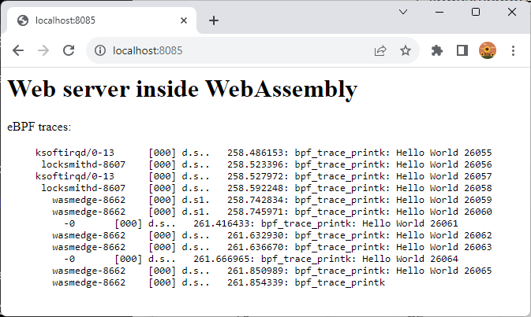

# Piccolo E2E Demo
This scenario demonstrates Piccolo's capabilities. You will deploy a WebAssembly module to [Flatcar OS](https://www.flatcar.org/) via cloud, then inject an [eBPF](https://ebpf.io/) module for diagnostics, monitoring the telemetry with [Prometheus](https://prometheus.io/). An approval workflow in Outlook precedes the eBPF deployment. The eBPF is given a time window to run and is then removed from the target.

## Prerequisites 
* **Symphony 0.45.33** or above is deployed to an AKS cluster - this will be your cloud-based control plane.
* **[kubectl](https://kubernetes.io/docs/reference/kubectl/kubectl/)** installed and configured with the above AKS cluster
* **Symphony repo** cloned on your demo machine - currently under the ```wasm-e2e``` branch.
* **[Cargo](https://doc.rust-lang.org/cargo/)** - for building Piccolo binaries.
* **[QEMU](https://www.qemu.org/)** - for running the Flatcar VM.

## Resource Requirements
| Binary | Remote Only<sup>1</sup> | Symphony Only<sup>2</sup> | WASM Only<sup>3</sup> | WASM + eBPF<sup>4</sup> | Docker Only<sup>5</sup> | Full Stack<sup>6</sup> |
|--------|--------:|--------:|--------:|--------:|--------:|--------:|
| `bpftool` |-|-|-|34.17 MB|-|34.17 MB|
| `containerd` |-|-|-|-|37.32 MB|37.32 MB|
| `containerd-shim-wasmedge-v1`|-|-|-|-|-|102.89 MB|
| `ctr`|-|-|-|-|18.25 MB|18.25 MB|
|`docker`|-|-|-|-|33.14 MB|33.14 MB|
|`docker-init`|-|-|-|-|0.73 MB|0.73 MB|
|`docker-proxy`|-|-|-|-|1.87 MB|1.87 MB|
|`dockerd`|-|-|-|-|60.41 MB|60.41 MB|
|`libwasmedge.so.0.0.3`|-|-|53.75 MB|53.75 MB|-|53.75 MB|
|`piccolo`|-|3.69 MB|3.69 MB|3.69 MB|3.69 MB|3.69 MB|
|`runc`|-|-|-|-|14.44 MB|14.44 MB|
|`wasmedge`|-|-|0.01 MB|0.01 MB|-|0.01 MB|
|`wasmedgec`|-|-|0.01 MB|0.01 MB|-|0.01 MB|
| **TOTAL**|0MB|3.69 MB|53.77 MB|91.63 MB|166.16 MB|360.68 MB|

<sup>1</sup>: Symphony prefers remote management interfaces. In this case, no Symphony agent is requried on the device.

<sup>2</sup>: Symphony agent can be used to deploy native binaries through shell scripts.

<sup>3</sup>: Symphony works directly with WASM runtime (wasmedge in this case) to deploy WASM modules.

<sup>4</sup>: Symphony works directly with WASM runtime and bpftool.

<sup>5</sup>: Symphony works with Docker engine (no WASM shim support).

<sup>6</sup>: Symphony agent + Docker + WASM runtime + Docker WASM shim + eBPF tool.

## Demo Preparation 
1. Download and uncompress Flatcar QEMU image:
```bash
wget https://stable.release.flatcar-linux.net/amd64-usr/current/flatcar_production_qemu_image.img.bz2
bunzip2 flatcar_production_qemu_image.img.bz2
```
> **NOTE**: [Flatcar Ignition](https://github.com/flatcar/ignition) happens only during first boot. To fully reset the demo, you'll need to restore to the original `.img` file.
2. Have Symphony (version 0.45.33 or above) installed on an AKS cluster.
3. Prepare a `demo` folder with these files:
  * `flatcar_production_qemu_image.img` from step 1.
  * `ignition.json` from `agent/ignition/ignition.json`.

## Demo Setup
1. Make sure your `kubectl` context is set to the correct Kubernetes cluster.
2. Open VSCode under the `docs/samples/piccolo` folder.

## Demo Steps

### I. Launch Flatcar VM ###
1. Launch Flatcar VM with QEMU:
    ```powershell
    .\qemu-system-x86_64.exe -m 2G -netdev user,id=net0,hostfwd=tcp::8085-:8085 -device virtio-net-pci,netdev=net0 -fw_cfg name=opt/org.flatcar-linux/config,file=c:\demo\ignition.json -drive if=virtio,file=c:\demo\flatcar_production_qemu_image.img
    ```
2. (Optinal) Poke around the VM:
    ```bash
    wasmedge --version # wasmedge is installed
    docker --version # docker is installed
    systemctl status piccolo # Piccolo service is active
    bpftool version # bpftool is installed
    ```

### II. Examine Symphony artifacts

1. Open `tiny-edge-target.yaml`. Point out that the targt (`tiny-edge`) uses a `providers.target.staging` provider, which stages the artifacts to be deployed on Symphony control plane instead of directly pushing them to the target. The artifact will be later picked up by a polling agent (Piccolo).

    > **NOTE**: In many scenarios, you don't have direct access to the tiny edge devices. Hence a polling agent is used to communicate with the control plane through an outbound connection.

2. Open `solution.yaml`. This is a simple solution (`tiny-app`) with a single WASM moudle, which hosts a simple web server. 

    >**NOTE**: Source code of the WASM module is under `docs/samples/piccolo/http-wasm`.

3. Open `instance.yaml`. This instance deploys `tiny-app` to `tiny-edge`.

### III. Deploy Symphony artifacts
1. Deploy target, solution and intance:
    ```bash
    kubectl apply -f tiny-edge-target.yaml
    kubectl apply -f solution.yaml
    kubectl apply -f instance.yaml
    ```
2. (Optional) The stage provider creates a new catalog object on the control plane, which you can retrieve by:
    ```bash
    kubectl get catalog
    ```
3. Open a Chrome browser on your demo PC and navigate to `http://localhost:8085/`. You should see a simple web page that says "TBD".

### IV. Deploy eBFP module



## Demo Clean up
1. Delete Symphony objects
    ```bash
    kubectl delete instance tiny-app
    kubectl delete target tiny-edge
    kubectl delete solution tiny-app
    kubectl delete catalog tiny-app-tiny-edge
    ```

## Appendix I: Building Binaries

In case if you want to rebuild some the binaries:

### Building Piccolo agent
```bash
# Under agent folder
cargo build --release
```

### Building tiny edge tack Flatcar image
```bash
# Under agent/scripts folder
./create_tiny_stack_sysext.sh 24.0.6 tiny_stack 14.0.4
```

### Building http-wasm
```bash
# Under docs/samples/piccolo/http-wasm folder
# Install wasi target if needed: rustup target add wasm32-wasi
cargo build --target wasm32-wasi
```

### Building the Hello, World! eBPF module
```bash
# Under docs/samples/piccolo/hello-ebpf
clang -target bpf -I/usr/include -I/usr/include/x86_64-linux-gnu -g -O2 -o hello.bpf.o -c hello.bpf.c
```