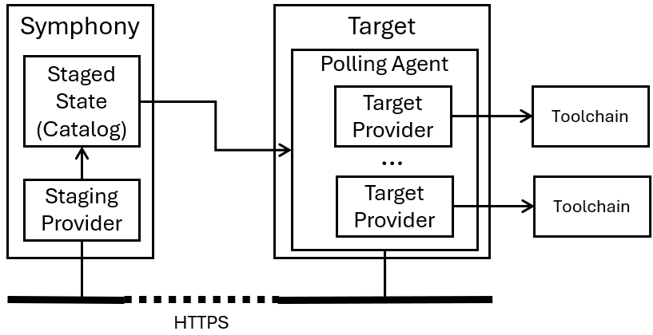

# Polling agent

_(last edit: 10/10/2024)_

Symphony polling agent connects to the Symphony control plane through a single outbound HTTPS connection. It reports target current states and retrieves the new desired states from the control plane. Then, it runs a local reconciliation process. The polling agent is used in conjunction with Staging Target provider, which stages the desired state on the control plane itself instead of pushing it out to the target. The polling agent periodically polls the control plane for updated desired states.



A polling agent can be deployed off the cluster where Symphony is running. It can also be deployed on the same cluster and optionally in a separate namespace, assuming the Symphony API endpoint is accessible. Because the on-cluster polling agent runs in a separate pod and potentially in a separate namespace, it offers certain capabilities of multi-tenancy on the same cluster. For example, a test framework can use Symphony to assign different test cases to polling agents in different tenant namespaces, and each polling agent is configured with just enough access rights to access the corresponding system.

## Workflow to configure a polling agent
1.  Configure and launch a polling agent process. A polling agent can run as a single process, a Docker container, or a Kubernetes service (while running on a Kubernetes cluster). The polling agent uses the same binary that is used by Symphony API. It’s just loaded with a different configuration file that puts itself into the agent mode.
2.  Define your target definition. The target should use a staged provider (either `providers.target.stage`. This provider writes the target desired state to a `Catalog` object, which can be then queried by a polling agent through Symphony API.
3.  Define your solutions and instances as usual. When the solution is deployed to the target, Symphony realizes that the desired state of the components needs to be staged on the control plane itself as a `Catalog` object. Once the object is written, it can be queried by a polling agent through the Symphony API.

## Polling agent configuration file

> **NOTE:** You can see a polling agent configuration for off-cluster agent here: [api/symphony-api-poll-agent.json](../../../api/symphony-api-poll-agent.json), and a polling agent configuration for on-cluster agent here: [api/symphony-k8s-poll-agent.json](../../../api/symphony-k8s-poll-agent.json).

The core polling agent functionality is delivered by the `vendors.solution` vendor (a vendor is a microservice in Symphony's architecture).
```json
{
        "type": "vendors.solution",
        "loopInterval": 15,
        "route": "solution",
        "managers": [
          {
            "name": "solution-manager",
            "type": "managers.symphony.solution",
            "properties": {
              ...
              "isTarget": "true",
              "targetNames": "test-target",
              "poll.enabled": "true"              
            },
            "providers": {
              ...              
              "rtos": {
                "type": "providers.target.script",
                "config": {
                  "name": "script",
                  "scriptFolder": ".",
		              "applyScript": "apply.sh",		              
                  "getScript": "get.sh"                  
                }
              },
              "configmap": {
                "type": "providers.target.configmap",
                "config": {
                  "inCluster": true                  
                }
              },
              "ingress": {
                "type": "providers.target.ingress",
                "config": {
                  "inCluster": true                  
                }
              }
            }
          }
        ]
      }
```
The vendor loads a `managers.symphony.solution` (a manager is a reusable business logic unit in Symphony's architecture), which defines how the agent represents on or more Symphony targets.

* **isTarget**: This is the flag that puts the process into the target agent mode. Like mentioned earlier, target agent is the same binary as what's used by the Symphony API. This flag puts the process into agent mode.
* **targetNames**: This is a comma-separate list that lists out Symphony target names the agent represents. An agent can represent one or more Symphony targets. **The names listed here must match with target names defined on the Symphony control plane.**
* **poll.enabled**: This is the attribute that enables the polling agent.
* Provider definitions. These provider definitions maps component types to target providers. For example, in the above configuration, the `rtos` component type is mapped to a `providers.target.script` provider. Note that in this case, the script folder is resolved relative to where the polling agent is running. This means a polling agent with script provider can keep all scripts locally without submitting them to cloud.

> **NOTE**: You don't need to define any protocol bindings as you do for the [target agent](target-agent.md), because the polling agent always uses HTTPS.

## Target definition
Your target definition needs to use a `providers.target.staging` to stage the target desired state on the control plane as a `Catalog` object, named as `<target-name>-state`. For example:

```yaml
apiVersion: fabric.symphony/v1
kind: Target
metadata:
  name: sample-staged-k8s
spec:  
  topologies:
  - bindings:
    - role: instance
      provider: providers.target.staging
      config:
        targetName: "sample-staged-k8s"
        inCluster: "true"   
```
## Related topics

* [Symphony lightweight polling agent (Piccolo)](./piccolo-agent.md)

 
