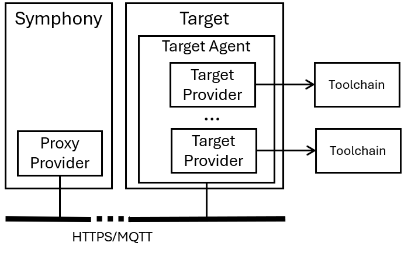

# Target agent

_(last edit: 6/4/2024)_

A Symphony target agent hosts [target providers](../providers/target-providers/target_provider.md) outside of the Symphony API process. The Symphony API process communicates with target agents through either HTTP or MQTT. You can configure a target agent to represent one or multiple [targets](../concepts/unified-object-model/target.md).



## Workflow to configure a target agent
1.  Configure and launch a target agent process. A target agent can run as a single process, a Docker container, or a Kubernetes service (while running on a Kubernetes cluster). The target agent uses the same binary that is used by Symphony API. It’s just loaded with a different configuration file that puts itself into the agent mode.
2.  Define your target definition. The target should use a proxy provider (either `providers.target.mqtt` for MQTT or `providers.target.proxy` for HTTP).
3.  Define your solutions and instances as usual. When the solution is deployed to the target, Symphony realizes that the components need to be deployed through a proxy provider and uses the proxy provider to communicate with the remote target agent process. 

## Target agent configuration file

> **NOTE:** You can see a sample agent configuration file at [docs/samples/multi-os/symphony-agent.json](../../samples/multi-os/symphony-agent.json)

The core target agent functionality is delivered by the `vendors.solution` vendor (a vendor is a microservice in Symphony's architecture).
```json
{
        "type": "vendors.solution",
        "loopInterval": 15,
        "route": "solution",
        "managers": [
          {
            "name": "solution-manager",
            "type": "managers.symphony.solution",
            "properties": {
              ...
              "isTarget": "true",
              "targetNames": "pc,rtos"  
            },
            "providers": {
              "pc": {
                "type": "providers.target.win10.sideload",
                "config": {
                  ...               
                }
              },
              "rtos": {
                "type": "providers.target.script",
                "config": {
                  ...
                }
              },
              ...
            }
          }
        ]
      }
```
The vendor loads a `managers.symphony.solution` (a manager is a reusable business logic unit in Symphony's architecture), which defines how the agent represents on or more Symphony targets.

* **isTarget**: This is the flag that puts the process into the target agent mode. Like mentioned earlier, target agent is the same binary as what's used by the Symphony API. This flag puts the process into the agent mode.
* **targetNames"**: This is a comma-separate list that lists out Symphony target names the agent represents. An agent can represent one or more Symphony targets. **The names listed here must match with target names defined on the Symphony control plane.**
* Provider definitions. These provider definitions maps component types to target providers. For example, in the above configuration, the `rtos` component type is mapped to a `providers.target.script` provider. 

The communication channel between the agent and the Symphony control plane is configured by the `bindings` configuration. The following example shows a sample MQTT binding:
```json
"bindings": [
    {
      "type": "bindings.mqtt",
      "config": {
        "name": "mqtt-1",
        "brokerAddress": "tcp://<MQTT broker address>:1883",
        "clientID": "windows-pc",
        "requestTopic": "coa-request",
        "responseTopic": "coa-response",
        "timeoutSeconds":  30
      }
    }
  ]
  ```
You can define multiple bindings, including multiple bindings for the same protocol, on a target agent.

## Target definition
Your target definition needs to use a `providers.target.mqtt` (MQTT) or a `providers.target.proxy` (HTTP), as shown in the following example.
Note your target name needs to match with the names in your agent's `targetNames` definition. And when you use MQTT, you need to make sure you are using the same `requestTopic` and `responseTopic` but different `clientID` on either side.

```yaml
apiVersion: fabric.symphony/v1
kind: Target
metadata:
  name: pc
spec:
  properties:
    location: "pc"
    scenario: "multi-os"
  topologies:
  - bindings: 
    - role: win.uwp
      provider: providers.target.mqtt
      config:
        name: proxy1
        brokerAddress: "tcp://<MQTT broker address>:1883"
        clientID: "test-cluster-1"
        requestTopic: "coa-request"
        responseTopic: "coa-response"
        timeoutSeconds:  "30"
```
