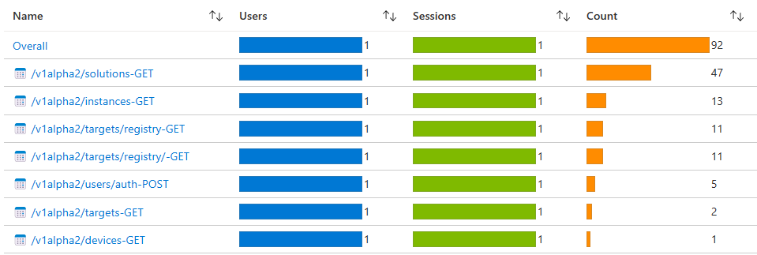

# Application Insight Middleware

The Application Insight middleware allows Symphony API consumption events to be collected to an [Azure Monitor](https://azure.microsoft.com/en-us/products/monitor) tenant, which is identified by an instrumentation key defined in a ```APP_INSIGHT_KEY``` environment variable.

The Application Insight Middleware is plugged into a [HTTP binding](../bindings/http-binding.md) via the binding’s [pipeline](../bindings/http-binding.md#pipeline) configuration, for example:
```json
"pipeline": [
    {
        "type": "middleware.http.telemetry",
        "properties": {
            "enabled": true,
            "maxBatchSize": 8192,
            "maxBatchIntervalSeconds": 2,
            "client": "my-dev-machine"
        }
    }
]
```
> **NOTE**: ```client``` is an optional string identifier for the current customer/installation. This could be set during installation/provision.

The middleware intercepts all Symphony API calls and record request path, method, and status code as a custom event.


Based on these events, you can collect usage information on things like "how many solutions are created/updated in the past month" and "how many targets are deleted today". Please note that because the API uses upsert to handle both creation and update, there's currently no easy way to distinguish between creation and update. However, given wide adoption of immutable infrastructure, the assumption is that update to solution/instance is less common. Regardless, this should be improved in future versions.