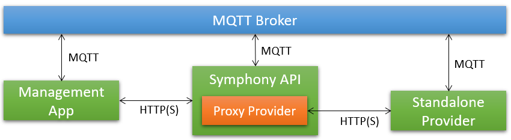

# Bindings

Symphony API is protocol agnostic. This means Symphony API can be bound to different communication protocols like [HTTP(S)](./http-binding.md), gRPC, and [MQTT](./mqtt-binding.md) through its binding mechanism. This design gives you great flexibility in Symphony deployment topology. For example, you can have a management app accessing Symphony API over HTTP, while connecting Symphony with a standalone provider (running on a remote/on-premise machine, for instance) over MQTT proxy provider.

## Related Topics

* [HTTP Binding](./http-binding.md)
* [MQTT Binding](./mqtt-binding.md)