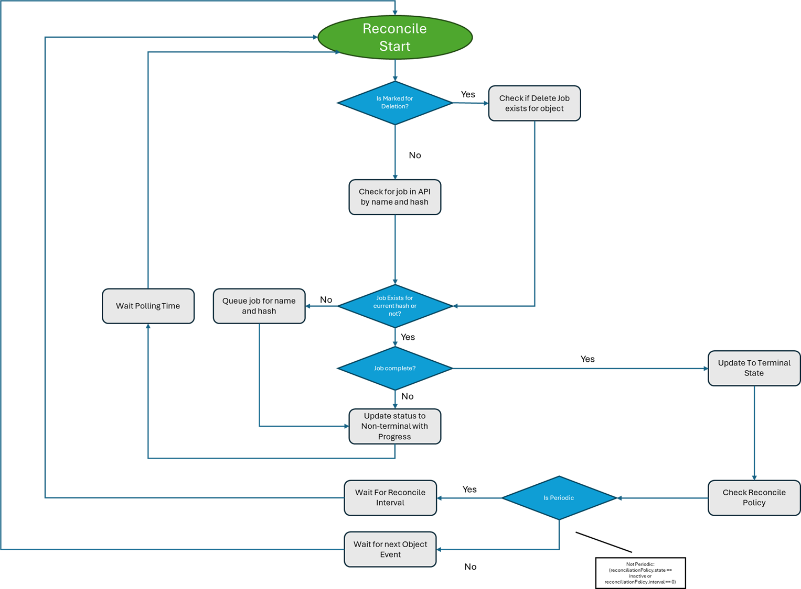

# Symphony Launch Mode

_(last edit: 4/25/2024)_

Symphony typically runs as a Kubernetes controller that operates Symphony CRDs. When running as a Kubernetes controller, Symphony delegates all state management of these CRDs to Kubernetes, and it integrates with Kubernetes reconciliation loop, uses webhooks to invoke Symphony API when the state of these objects change. So, Symphony Kubernetes controller is a very thin layer hooking up to Kubernetes API server, while all Symphony business logic resides behind Symphony API. Using the same architecture, we allow Symphony to run natively as an [Azure resource provider](https://learn.microsoft.com/azure/azure-resource-manager/management/resource-providers-and-types) that forwards external resource operations (such as update and remove) to Symphony API, as shown in the following diagram.


However, when running in a standalone mode, Symphony takes over object state management by itself. Symphony allows object state to be stored in any supported data storage via a state provider and it runs a state reconciliation loop that periodically generates a reconciliation job. Symphony listens to these jobs and invokes corresponding APIs for state reconciliation. This separation of job creation and job execution allows Symphony to handle both automatic reconciliation as well as on-demand reconciliation using the same job manager.

## State reconciliation flows

### Kubernetes mode

Under Kubernetes mode, users interact with Symphony Kubernetes CRDs using Kubernetes APIs and tools. Symphony controller queries Symphony API (via `/queue GET`), calculates the deployment spec, and check its parity, then decide if a new reconciliation job needs to be queued. 

If requeue is needed, Symphony controller queues a new deployment job through the `/queue POST` route. The queued job is forward to a event bus, to which a [job vendor](../vendors/job.md) subscribes. When a reconcile job is received, the job vendor uses the Symphony deployment spec generated in Symphony controller and calls the `/reconcile` route of a solution vendor.

And Symphony controller exposes fine-grained reonciliation policy control to let users decide how to reconciliate when current spec is converged to termination state. 

In target and instance k8s spec, users can define an optional property - reconciliationPolicy.

```yaml
spec:
    reconciliationPolicy:
        state: <active or inactive>
        interval: <optional, e.g. 1m>
```

By default, Symphony controller will use periodic reconciliation policy. If the caller doesn't set `reconciliationPolicy`, or doesn't explicitly specify `reconciliationPolicy.interval`, the default interval will be `30m`. 

The caller can disable the periodic reconciliation policy by setting `reconciliationPolicy.interval = 0` or `reconciliationPolicy.state = 'inactive'`.

Whenever an instance or a target is changed, The generation is bumped by the kubernetes API server which in turn triggers a reconciliation on the controllers. We then go through the following steps,



### Standalone mode

When running under the standalone mode, Symphony REST API queues reconciliation jobs when it updates Symphony objects. In addition, the job vendor is configured to periodically trigger reconciliation events by itself at configured intervals.

Once the job vendor subscribes the new reconciliation event, it will generate the deployment spec and calls the `/reconcile` route of a solution vendor.

And under standalone mode, the reconciliation policy is not configured on individual resource, which is different from Kubernetes mode.


## Launch Symphony in standalone mode

Symphony runs as a single process in standalone mode. To launch Symphony in standalone mode, simply launch the `symphony-api` binary with a configuration file and an optional tracing level switch (such as `Error`, `Info` and `Debug`):

```bash
./symphony-api -c ~/symphony-api-no-k8s.json -l Debug
```

Once launched, you can access Symphony's [REST API](../api/_overview.md) using any web clients.

## Next steps

* [Quick start - launch a Redis container with standalone Symphony](../get-started/deploy_redis_no_k8s.md)