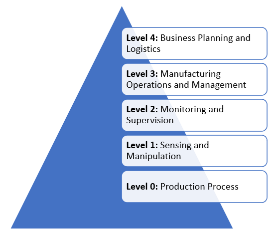

# Information graph

Symphony provides a generic graph data structure through the object type `catalog`. A catalog can be used to model any information ontologies, hardware topologies, asset trees, BOMs, artifact catalogs and more.

Typically, an enterprise needs to manage diverse catalogs encompassing assets, software packages, configurations, and policies. Various personnel within an organization often require access to these catalogs, each with their unique perspectives and scopes. Unfortunately, this valuable information is frequently dispersed across multiple storage repositories behind different systems. This fragmented scenario poses a considerable challenge when it comes to gaining a comprehensive and coherent understanding of the organization's inventory.

Symphony views enterprise information ontology as a distributed graph. Instead of attempting to centralize the information within a singular repository or standardize its format, Symphony introduces a fundamental concept: the *catalog* object. The catalog object acts as an index pointing to specific pieces of information. Subsequently, Symphony deploys a graph engine atop these dispersed catalog objects, enabling the creation and interrogation of various information graphs, thus fostering flexibility and versatility in how information can be structured and accessed.

Leveraging the Symphony catalog object and its accompanying graph engine, an enterprise gains the capability to effortlessly construct models of asset hierarchies, network topologies, template collections, and a myriad of other information graphs. Furthermore, Symphony objects can be annotated with catalog information, facilitating seamless cross-referencing across diverse catalogs in a user-friendly and intuitive manner.

## Catalog and synchronization

The Symphony catalog object is also a unit of synchronization. When multiple Symphony control planes are linked with each other, their catalogs can be synchronized among them with one-way synchronizations only. This means that at any given time, a catalog has one and only one owner. Others may hold read-only copies for their own usage. They can create overlays that override the original catalog object, but they can’t modify the original object. This design avoids complex two-way synchronizations and maintains a single source of truth for all catalog objects.

Symphony refrains from synchronizing other types of objects because these objects often encapsulate unique states. States typically hold significance within specific, delimited contexts. In the event of indiscriminate state transmission, there arises the necessity to discern whether a given state applies to the current context. Symphony addresses this challenge by permitting snapshots of state to be transported within catalogs, but the underlying state itself remains confined to its designated scope. This approach obviates the need to differentiate between local and non-local states, as all states are inherently local. Remote management experiences are then facilitated by the transmission of read-only state indexes.

## Example: Model a factory using the ISA95 model

The following diagram illustrates a typical structure of an industrial automation system using the ISA95 model. Such a system encompasses multiple sub-systems, including ERP, MES, and SCADA, as well as various device categories like servers, PLCs, and sensors. Additionally, it involves multiple network connections, various user roles, policies, and numerous other components.

Using Symphony Catalogs, you can model various aspects of the system as graphs and link into existing data sources like ERP systems. And then, you can associate dynamic states of your software, hardware, configurations and policies with these graphs to gain end-to-end visibility of the entire system.

Symphony offers several key platform-agnostic capabilities for modeling such a complex system:

* Modeling arbitrary information graph using Catalogs such as:
  * Asset trees
  * BOMs
  * Network topologies
  * Application templates
  * Configurations
  * Policies
* Modeling the entire stack of software on devices using Targets.
* Modeling applications using Solutions.
* Modeling application deployment topologies using Instances.
* Modeling AI pipelines using AI Skill.
* Modeling distributed workflows using Campaigns.

And because Symphony allows live states to be associated with the information graph, you can use these information graphs to gain live insights of your systems from different perspectives of your choice.

## Related topics

* [Catalog](./unified-object-model/catalog.md)