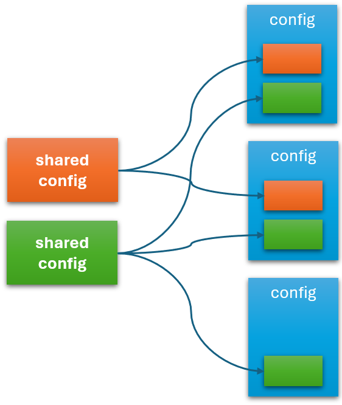

# Componentization

Componentization allows you to extra common, reusable parts of your configurations into reusable parts. For example, instead of repeating some global configurations in different places, you can extract these global configurations into a global configuration object and refer to it via Symphony expressions anywhere in your Symphony artifacts (such as other configurations, Solutions or Targets).

Componentization is an important tool to reduce unnecessary duplications in your configurations. This not only simplifies configuration management, but also ensures consistency. For example, when you update a global configuration object, its new value will be picked up by all affected objects when their expressions are evaluated. 

In addition to abstracting static values, you can also use contextual Symphony expressions in your shared configuration objects. See [contextualization](./contextualization.md) for more details.

