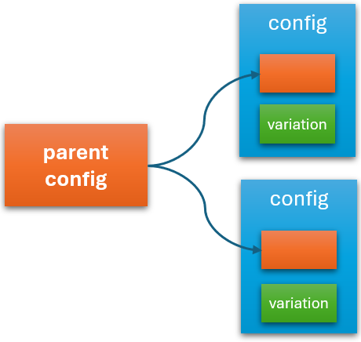

# Inheritance 
Horizontal scaling on edge is different from horizontal scaling on cloud. On cloud, you replicate the application to multiple identical instances to share the load. On edge, each of the scaled instances has its own specific context. Hence, you are not scaling identical copies in this case. Instead, you are scaling multiple similar instances. 

Inheritance allows you to capture the static part of your application configuration into a parent object. And each variation can inherit from the common parent and then adds its own variations.

 

You can define an inheritance relationship among Symphony objects by annotating the child object with a `parentName` property, which points to the object it inherits. When a catalog inherits a parent, it automatically inherits all properties from the parent. And it can override parent value by redefining the corresponding key. 

Although Symphony allows multiple levels of inheritance, it doesn’t allow multiple inheritance (i.e. an object has multiple parents), which in practice is hard to understand or manage. However, you can use configuration references to “blend-in” multiple configuration objects.

## Override chain

When you try to resolve a configuration using a `$config()` expression, you can specify a list of overrides, such as `$config(site-config, setting-key, line-config1, line-config2)`. In this case, Symphony will try to resolve the `setting-key` value from the `line-config1` object and fall back to `line-config2` and eventually `site-config` if the key is not found.