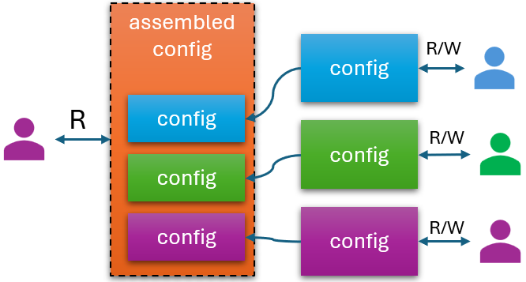

# Configuration and RBAC
In a large-scale deployment, different configurations are managed by different personas with different access rights and diverse capabilities. Symphony allows you to organize these parts into different objects and assign RBAC rules to these objects separately.

With [componentization](./componentization.md), you can split monolithic configuration objects into small pieces and apply fine-granular access control on individual pieces. These users have write access to only the responsible pieces and can’t modify anything else. On the other hand, a different user can be assigned with read-only access to the assembled configuration object.

When Symphony is hosted on a platform such as Kubernetes or Azure ARM, it inherits RBAC control from the corresponding system. This applies to not only the Catalog objects, but also to other objects as well.

With Symphony workflow, you can also implement Just-In-Time (JIT) access pattern that allows certain updates to happen only during certain maintenance windows. Please see [approval and other workflows](./approval-and-workflows.md) for more details.