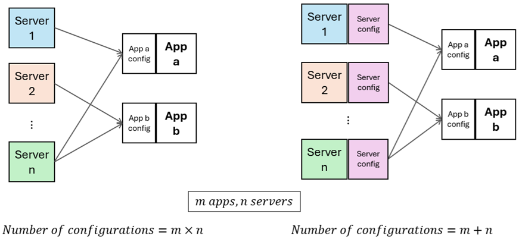
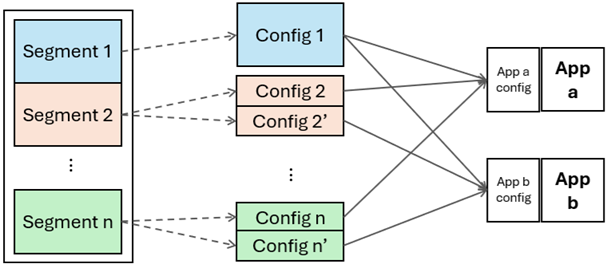
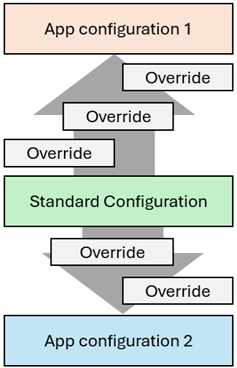

# Configuration Management Recommendations
Symphony separates configuration management and configuration serving. This allows users to break away from a file-based configuration management paradigm and leverage Symphony’s rich configuration modeling capabilities to improve efficiency and control complexity of large-scale configuration management.

This document summarizes several recommended configuration management practices that can better leverage Symphony configuration management capabilities for large enterprises.

## Decouple app configuration and infrastructure configuration  
Because Symphony separates configuration management and configuration serving, you have greater flexibility in configuration schema design without being confined by expectations of a specific application. With this in mind, you can design and manage configurations that are better aligned with the asset topologies, business units or device ownerships. Then, relevant information can be assembled for different applications. 

Assume there are `m` applications that can be deployed on `n` different servers. If you model application configurations directly, there would be `m × n` possible variations. On the other hand, if application configurations can be assembled based on server configurations, you need to manage only `m + n` configurations. Furthermore, if server configurations can be standardized, you can use `1` parameterized server configuration instead of `n` server-specific configurations. 

## Componentization 
When you have configuration segments that are applicable to different scopes, you can componentize these segments into separate configurations. Then, you can create variations for specific scopes while reusing parts that can be shared across these scopes, as shown in the following figure:

Breaking up a monolithic configuration into smaller pieces offers several benefits:
* Reduced Cognitive Burden: Managing componentized configurations is less cognitively demanding. Personnel who are familiar with the specific details of each scope can maintain them with greater accuracy, as they are not overwhelmed by the complexities of a larger system.
* Enhanced Reusability: Configurations for larger scopes tend to change less frequently, providing a stable base. This stability allows for smaller-scope configurations, which have finer granularity, to evolve at a quicker pace while still leveraging the stable configurations of the larger scopes. This approach significantly improves the reuse of configurations.
* Flexible Access Control: Componentized configurations facilitate fine-grained access control. Individuals are granted only the minimum necessary access to specific configurations, enhancing security. This structure also simplifies the process of tracking changes, making it easier to determine who made specific changes and when.

Overall, these changes lead to a more efficient and manageable configuration process, allowing for both higher accuracy in maintenance and greater flexibility in adaptation and security.

## Standardized configuration with local overrides 
Symphony allows configurations to be assembled with multiple levels of overrides. This offers an opportunity to create standardized configurations that can be customized with local overrides without affecting the standardized configurations themselves. The standardized configurations don’t need to accommodate for all possible variations when they are applied at a specific scope. Instead, local customizations can be applied to tailor the standard configurations for specific scenarios. 

Local overrides can also be designed as “switches” that field operation can turn on and off within their access rights. This allows the field to quickly respond to production line changes (again, within the designated scope) 

## Leverage other Symphony features

Because Symphony is a unified orchestrator of tool chains, configurations are not managed in isolation in Symphony. For example, a configuration field can refer to a server property (such as IP address or DNS name) because Symphony is aware of the server as well. Some Symphony features that can be used in conjunction with configuration management include:

* Approval. Configuration modification and application can be gated by a customizable approval workflow. 
* Scheduled deployment. Configurations can be pushed out and applied during designated time windows (such as when the production line is offline for maintenance).
* Graph database. Configuration objects can be corelated with other information graphs such as organization charts, BOM and office locations. These associations allow configurations to be displayed together with other graph information for an intuitive view. 
* Trail. All object mutations can be recorded into an immutable ledger for irrefutable record keeping. This is useful when partners and contractors are involved in operations and a definite track record needs to be kept.
