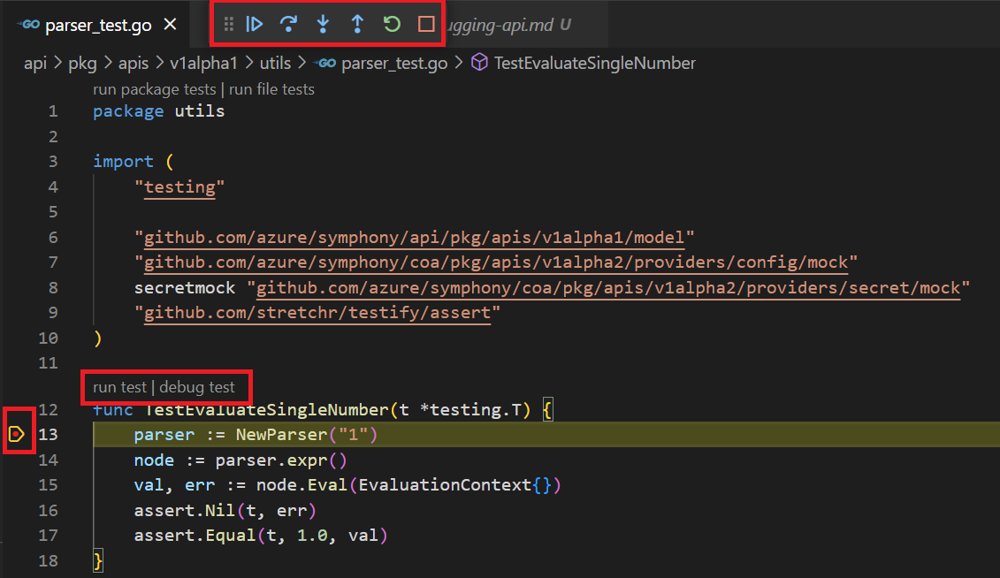

# Debugging Symphony API Locally

## Leveraging Unit Tests

The best way to test a specific Symphony API component is to write/use unit test cases in the project to test the component in isolation. With VS Code extensions like [Code Debugger]( https://marketplace.visualstudio.com/items?itemName=wowbox.code-debuger), you can set up break point and trace through the code, as shown in the following screenshot:



> **NOTE**: If you use VS Code with a WSL folder, please make sure you have the [WSL extension](https://marketplace.visualstudio.com/items?itemName=ms-vscode-remote.remote-wsl) installed.


## Using Postman

Symphony exposes a REST API, which you can call using tools like [Postman](https://www.postman.com/). 
1. Build and launch Symphony API as a local process:
   ```bash
   # folder: symphony/api
   go mod vendor
   go build -o symphon-api
    ./symphony-api -c ./symphony-api-dev.json -l Debug
    ```
2. Use Postman to send API calls to ```http://localhost:8080/v1alpha2```. See [Sample Requests](#sample-requests) for examples of API requests.
3. Add temporary log statements to trace what's happenin, rebuild and re-launch and use the console to observe logs.

## Sample Requests
1. Deploy a Redis server as a new ```Instance```.

   > **NOTE**: This request assumes your ```kubectl``` is configured to use your target K8s cluster as the default context. If you want to use a different cluster, either update your ```kubectl``` settings to use the new cluster as the default context (using ```kubectl config use-context <context-name>```), or you'll need to modify the Symphony API configuration file (like ```symphony-api-dev.json```) and update the corresponding target provider settings.

   * Method: POST
   * Path: http://localhost:8080/v1alpha2/solution/instances|
   * Body

        ```json 
        {
            "instance": {
                "scope": "default",
                "name": "redis-instance",
                "stages": [
                    {
                        "solution": "my-solution",
                        "target": {
                            "name": "my-k8s"
                        }
                    }
                ]
            },
            "stages": [
                {
                    "solution": {
                        "name": "my-solution",
                        "components": [
                            {
                                "name": "redis-server",
                                "properties": {
                                    "type": "docker",
                                    "container.image": "docker.io/redis:6.0.5"
                                }
                            }
                        ]
                    },
                    "targets": {
                        "my-k8s": {
                            "topologies": [
                                {
                                    "bindings": [
                                        {
                                            "role": "instance",
                                            "provider": "providers.target.k8s",
                                            "config": {
                                                "configType": "path"
                                            }
                                        }
                                    ]
                                }
                            ]
                        }
                    },
                    "assignments": {
                        "my-k8s": "{redis-server}"
                    },
                    "componentStartIndex": 0,
                    "componentEndIndex": 0
                }
            ]
        }

2. Delete the above Instance:

    * Method: DELETE
    * Path: http://localhost:8080/v1alpha2/solution/instances?name=redis-instance

    * Body: Same as above. 
    
    > **NOTE**: Symphony requires the deployment object to be posted during deletion because it aims to make providers stateless. The state is played back to the provider to make decisions.
