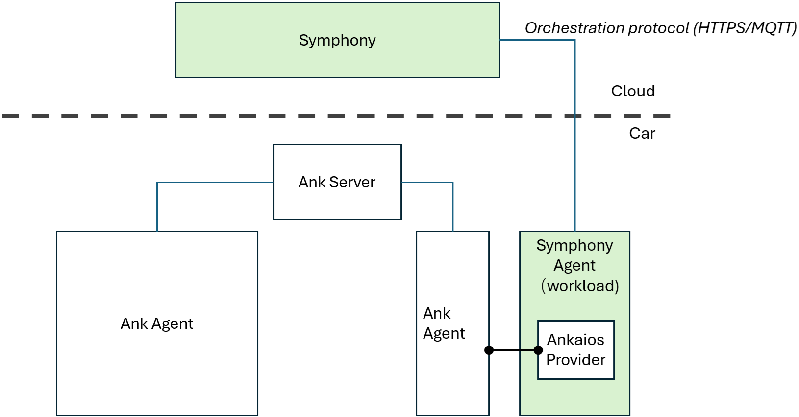
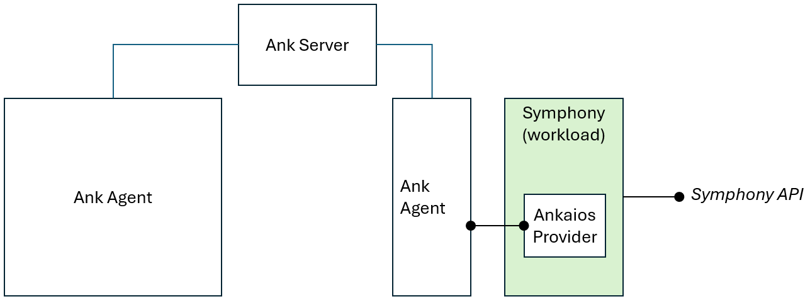

# Implementing a Rust Target Provider
In this walkthrough, we’ll use implementing a Rust provider for [Eclipse Ankaios](https://eclipse-ankaios.github.io/ankaios/0.2/) as an example to walk you through the steps of creating a new Symphony [Target provider](../providers/target-providers/target_provider.md) using Rust. 

## 1. Deciding on the integration point 

Ankaios aims to bring cloud-native practices to automated HPCs while meeting the safety and real-time requirements of the automotive industry. It consists of an Ankaios server that manages multiple Ankaios agents. As a toolchain orchestrator, Symphony does not interfere with the internal workings of Ankaios components. Instead, Symphony treats the entire Ankaios system as a Target that provides in-vehicle orchestration. The Ankaios Target can be annotated with feature flags, enabling Symphony—acting as a fleet management layer in this case—to make fleet-level decisions based on these flags. For example, a Solution component can request installation on an Ankaios-enabled Target.

## 2. Setting up local test environment

When you develop a provider, it's important to have a high-fidelity test environment so that you can test your provider functionalities locally in isolation before conduting more complex integration tests. 

Install Ankaios following the [official instruction](https://eclipse-ankaios.github.io/ankaios/latest/usage/installation).
```bash
# Install without mTLS
curl -sfL https://github.com/eclipse-ankaios/ankaios/releases/latest/download/install.sh | bash -
# Start Ankaios server
sudo systemctl start ank-server
# Start an Ankaios agent
sudo systemctl start ank-agent
# Check server status
sudo systemctl status ank-server
# You sould see the server is active, and has received a AgentHello message from 'agent-A'
```
## 3. Preparing your provider project
>**NOTE:** We assume you've already have Rust and Cargo install.

**IMPORTANT:** If you are contributing your provider source code to Symphony, you should fork Symphony repository and put your provider project under the `api/pkg/apis/v1alpha1/providers/target/rust/rust_providers` folder. You should also modify the `api/pkg/apis/v1alpha1/providers/target/rust/Cargo.toml` file to include your project into the workspace. This will join your project into our automated build and release pipeline. For example:
```toml
[workspace]
members = [
    "symphony",
    "rust_providers/mock",
    "rust_providers/ankaios"
]
```

1. Create a new Rust project using Cargo:
    ```bash
    cargo new ankaios --lib
    cd ankaios
    ```

2. Modify your `Cargo.toml` file to add a reference to Symphony crate.
    ```toml
    [dependencies]
    symphony = "0.1.1"
    ```
    If your project is under the Symphony source code structure, you can also opt to refer to the local Symphony Rust binding src:
    ```toml
    [dependencies]
    symphony = { path = "../../symphony" }
    ```
3. Change your crate type to C dynamic library:
    ```toml
    [lib]
    crate-type = ["cdylib"]
    ```

4. Replace the content of your `lib.rs` with this code:
    ```rust
    extern crate symphony;

    use symphony::models::{
        ProviderConfig, ValidationRule, DeploymentSpec, ComponentStep, ComponentSpec,
        DeploymentStep, ComponentResultSpec,
        ComponentValidationRule
    };
    use symphony::ITargetProvider;
    use symphony::ProviderWrapper;
    use std::collections::HashMap;
    
    pub struct AnkaiosProvider;

    #[no_mangle]
    pub extern "C" fn create_provider() -> *mut ProviderWrapper  {
        let provider: Box<dyn ITargetProvider> = Box::new(AnkaiosProvider {});
        let wrapper = Box::new(ProviderWrapper { inner: provider });
        Box::into_raw(wrapper)
    }

    impl ITargetProvider for AnkaiosProvider {
        fn init(&self, _config: ProviderConfig) -> Result<(), String> {
            Ok(())
        }
        fn get_validation_rule(&self) -> Result<ValidationRule, String> {
            let validation_rule = ValidationRule {
                required_component_type: "".to_string(),
                component_validation_rule: ComponentValidationRule {
                    required_component_type: "".to_string(),
                    change_detection_properties: vec![],
                    change_detection_metadata: vec![],
                    required_properties: vec![],
                    optional_properties: vec![],
                    required_metadata: vec![],
                    optional_metadata: vec![],
                },
                sidecar_validation_rule: ComponentValidationRule {
                    required_component_type: "".to_string(),
                    change_detection_properties: vec![],
                    change_detection_metadata: vec![],
                    required_properties: vec![],
                    optional_properties: vec![],
                    required_metadata: vec![],
                    optional_metadata: vec![],
                },
                allow_sidecar: true,
                scope_isolation: true,
                instance_isolation: true,
            };
        
            Ok(validation_rule)
        }
        fn get(&self, _deployment: DeploymentSpec, _references: Vec<ComponentStep>) -> Result<Vec<ComponentSpec>, String> {
            Ok(vec![])
        }
        fn apply(
            &self,
            _deployment: DeploymentSpec,
            _step: DeploymentStep,
            _is_dry_run: bool,
        ) -> Result<HashMap<String, ComponentResultSpec>, String> {
            Ok(HashMap::new())
        }
    }
    ```
5. Build your project to make sure everything is in place:
    ```bash
    cargo build
    ```
👍 Great! Now you are ready to implement your provider!

## 4. Implementing the `get()` method
Symphony periodically calls the `get()` method to retrieve the current system state. Since Symphony does not require a provider to maintain any state, it specifies the relevant deployment (via the `deployment: DeploymentSpec` parameter) and components (via the references: `Vec<ComponentStep> parameter`) it is interested in. Typically, you should iterate over the components in the references parameter and construct a `Vec<ComponentSpec>` array as the return value.
### 4.1 Decide on what constitutes a `Component`
A Symphony `Solution` consists of one or more `Components`. When a system integrates with Symphony, it can choose to represent its entire (relevant) system state as a single Symphony `Component` or expose a more granular construct.

For Ankaios, you can either treat the entire Ankaios system state as a single `Component` or represent each Ankaios workload as a separate `Component`.

The choice of granularity depends on your specific use case. However, opting for finer granularity provides opportunities to leverage more Symphony features. For example, by treating each Ankaios workload as a separate `Component`, you can use Symphony's component dependency feature to ensure workloads are provisioned in the correct order.

In this walkthrough, we'll treat an Ankaios workload as a `Component`.

A Symphony `Component` consists of a name, a type, and a key-value property bag.

* Component **name**: A unique identifier within a Solution.
* Component **type**: An arbitrary string. However, for a specific system, it's best to use a consistent type string, such as `ankaios-workload`. Symphony uses this type string to identify the corresponding `TargetProvider` that claims to handle that component type.
* Component **properties**: A collection of key-value pairs that can store any relevant information. However, you must ensure that these properties can be reliably reconstructed when requested by Symphony. Symphony uses these properties—along with validation rules (covered in the next section)—to determine whether an update is required. If the property values are unstable, you may trigger constant reconciliations.

### 4.2 Deploying an Ankaios workload
We'll manually deploy an Ankaios workload for testing purposes. In this walkthrough, we'll run a Ngix server on Podman:
```bash
ank -k run workload \
nginx \
--runtime podman \
--agent agent_A \
--config 'image: docker.io/nginx:latest
commandOptions: ["-p", "8087:80"]'
```
### 4.3 Add Ankaios references
At the time of writing, Ankaios Rust SDK crate hasn't been published. You'll need to add a reference through their Git repository. Please consult Ankaios documents for updates.
Modify your `Cargo.toml` file to include a reference to `ankaios-sdk`:
```bash
[dependencies]
symphony = "0.1.1"
ankaios-sdk = { version = "0.5.0-rc1", git = "https://github.com/GabyUnalaq/ank-sdk-rust.git", branch = "first-version" }
```
### 4.4 Implement the `get()` method
In the current version, Symphony’s `ITargetProvider` is a synchronous interface. To access asynchronous APIs, you’ll need to create a asynchronous wrapper. For example:
```rust
fn get(
    &self,
    _deployment: DeploymentSpec,
    _references: Vec<ComponentStep>,
) -> Result<Vec<ComponentSpec>, String> {
    self.runtime.block_on(self.async_get(_deployment, _references))
}
```
Then, you can implement your asynchronous `get()` method. For more detailed example, please see the `aync_get()` method in `api/pkg/apis/v1alpha1/providers/target/rust/rust_providers/ankaios/src/lib.rs`.

### 4.5. Testing the `get()` method
Before we move forward, let's make sure the `get()` method is working as expected. If your system is directly testable from your local environment, we recommend you writing a test case in your `lib.src` file to test the `get()` method:
```rust
#[cfg(test)]
mod tests {
    use super::*;
    use symphony::models::{DeploymentSpec};

    #[test]
    fn test_get() {
        let provider = AnkaiosProvider {
            runtime: tokio::runtime::Runtime::new().unwrap(),
            ank: std::sync::Arc::new(std::sync::Mutex::new(None)),
        };

        // Initialize provider
        provider.init(Default::default()).expect("Failed to initialize provider");

        let deployment = DeploymentSpec::empty();
        let references = vec![];

        let result = provider.get(deployment, references);
        assert!(result.is_ok(), "Expected Ok result, but got {:?}", result);
    }
}
```
> **NOTE:** For Ankaios' case, though, we can't directly test the code like this, becasue Ankaios SDK only works inside an Ankaios workload. To test our code, we'll need to package a Docker container and load it as a workload to Ankaios. Please see [Appendix](#appendix-packaging-and-deploying-to-ankaios) for more details.

## 5. Implementing the `apply()` method
The `apply()` method applies the new desired state to the system. Symphony sends the current deployment (`DeploymentSpec`) that contains all information about the current `Solution` and `Targets`. It also sends the current deployment step (`DeploymentStep`) that contains the current operations the provider needs to do, i.e. updating components or deleting components. Most provider only need to access the deployment step parameter, while some providers may need to consult the whole deployment object for additional context.
When handling the deployment step, your provider should loop through the step components and perform corresponding actions, such as:
```rust
for component in step.components.iter() {
    if component.action == ComponentAction::Delete {
        // delete the component
    } else if component.action == ComponentAction::Update {
        // create or update the component
    }
}
```
For each operated component, you should return a `ComponentResultSpec` indicating the operation result:
```rust
let component_result = ComponentResultSpec {
    status: State::OK,
    message: "Component applied successfully".to_string(),
};
result.insert(component.component.name.clone(), component_result);
// failure
let component_result = ComponentResultSpec {
    status: State::InternalError,
    message: format!("Failed to apply workload: {:?}", e),
};
```
## 6. Integrated test
1. Build all Symphony containers
    ```bash
    # under Symphony repo test/localenv folder
    mage build:all
    ```
2. Deploy Symphony API as a Ankaios payload. See [Appendix](#appendix-packaging-and-deploying-to-ankaios) for more details.
3. Get a Symphony security token:
    ```bash
    TOKEN=$(curl -X POST -H "Content-Type: application/json" -d '{"username":"admin","password":""}' http://localhost:8082/v1alpha2/users/auth | jq -r '.accessToken')    
    ```    
4. Define the `Target` object (REST API request `JSON` format):
    ```json
    {
        "metadata": {
            "name": "rust-test-target"
        },
        "spec": {
            "forceRedeploy": true,             
            "topologies": [
                {
                    "bindings": [
                        {
                            "role": "instance",
                            "provider": "providers.target.rust",
                            "config": {
                                "name": "rust-lib",
                                "libFile": "/extensions/libankaios.so",
                                "libHash": "e003229777175945d212470ad1c145d593fcad695a31b9c8898efcdd3d408207"
                            }
                        }
                    ]
                }
            ]
        }
    }
    ```
    Note that when you use the default Symphony Dockerfile, the Ankaios library is automatically built and copied to the `/extensions` folder of the Symphony API container. You can also opt to manually deploy your libraries manually by copying the libraries to the `symphony-api` pod.
    Symphony also verifies the library's hash code before it loads the library. To get the SHA-256 hash of the library file, you can use the `sha256sum` command, for example:
    ```bash
    sha256sum api/pkg/apis/v1alpha1/providers/target/rust/target/release/libankaios.so
    ```
    Apply the `Target` definition:
    ```bash
    # sample available under the docs/samples/ankaios folder
    # Note the last segment of path needs to match with the metadata.name field in your JSON file, in this case ankaios-target
    curl -X POST -H "Authorization: Bearer $TOKEN" -H "Content-Type: application/json" -d @target.json http://localhost:8082/v1alpha2/targets/registry/ankaios-target
    ```
5. Define the `SolutionContainer` object and the `Solution` object.

    SolutionContainer:
    ```json
    {
        "metadata": {
            "name": "ankaios-app"
        }
    }
    ```

    Solution:
    ```json
    {
        "metadata": {
            "name": "ankaios-app-v-v1"
        },
        "spec": {
            "rootResource": "ankaios-app",
            "components": [
                {
                    "name": "ankaios-app",
                    "type": "ankaios-worload",
                    "properties": {
                        "hello_ankaios": {
                            "runtime": "podman",
                            "agent": "agent_A",
                            "controlInterfaceAccess": {
                                "allowRules": [
                                    {
                                        "type": "StateRule",
                                        "operation": "ReadWrite",
                                        "filterNask": [ "*" ]
                                    }
                                ]
                            },
                            "runtimeConfig": "image: localhost/app:0.1"
                        }
                    }
                }
            ]
        }
    }
    ```
6. Apply the `SolutionContainer` and `Solution` object:
    ```bash
    # SolutionContainer
    curl -X POST -H "Authorization: Bearer $TOKEN" -H "Content-Type: application/json" -d @solution_container.json http://localhost:8082/v1alpha2/solutioncontainers/ankaios-app
    # Solution
    curl -X POST -H "Authorization: Bearer $TOKEN" -H "Content-Type: application/json" -d @solution.json http://localhost:8082/v1alpha2/solutions/ankaios-app-v-v1
    ```
7. Define the `Instance` object:
    ```json
    {
        "metadata": {
            "name": "ankaios-app-instance"    
        },
        "spec": {
            "solution": "ankaios-app:v1",
            "target": {
                "name": "ankaios-target"
            },
            "reconciliationPolicy": {
                "interval": "1m"
            }
        }
    }
    ```
8. Apply the `Instance` object:
    ```bash
    curl -X POST -H "Authorization: Bearer $TOKEN" -H "Content-Type: application/json" -d @instance.json http://localhost:8082/v1alpha2/instances/ankaios-app-instance
    ```
## Appendix: Packaging and deploying to Ankaios
In a production deployment, Symphony acts as cloud-based fleet manager that manages a fleet of cars. A Symphony agent is deployed as an Ankaios workload and interact with Ankaios system to manage workloads, as shown in the following diagram:

For local testing purposes, we can directly deploy Symphony as an Ankaios workload, and then submit test workloads through the Symphony API, as shown in the following diagram:

To deploy Symphony API as an Ankaios payload, we'll need to deploy Symphony API container in the `no-k8s` mode, which indicates Symphony running outside of Kubernetes. You can use the `ank -k run workload` command above to deploy Symphony API container, or you can modify `/etc/ankaios/state.yaml` to make Symphony API part of the Ankaios system state, as shown in the following sample `state.yaml` file:
```yaml
apiVersion: v0.1
workloads:
  symphony:
    runtime: podman
    agent: agent_A
    restartPolicy: ALWAYS
    tags:
      - key: owner
        value: Symphony
    runtimeConfig: |
      image: ghcr.io/eclipse-symphony/symphony-api:latest
      commandOptions: ["-p", "8082:8082","-e","CONFIG=/symphony-api-no-k8s.json"]
```
Once Ankaios picks up the new state, you should see your Symphony API running on `podman` via command:
```bash
sudo podman ps

CONTAINER ID  IMAGE                                         COMMAND               ...
6e2229084f20  ghcr.io/eclipse-symphony/symphony-api:latest  /bin/sh -c sh -c ...  ...
```
Now you should be able to access Symphony REST API through `http://localhost:8082`.

If you want to use a local Docker container image that hasn't been pushed to a container registry, you need to first import that container image into podman:
```bash
docker tag ghcr.io/eclipse-symphony/symphony-api:latest symphony:latest
docker save -o symphony.tar symphony:latest
sudo podman load -i symphony.tar
```