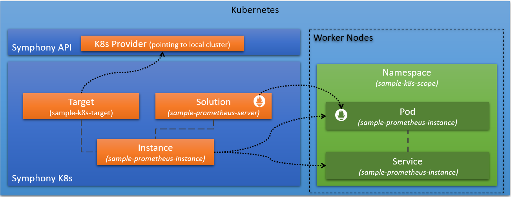

# Symphony quickstart - Deploy a Prometheus server to a Kubernetes cluster

_(last edit: 9/18/2023)_

This quickstart walks you through the steps of deploying a new Symphony solution instance to the cluster.

> **NOTE**: The following steps are tested under a Ubuntu 20.04.4 TLS WSL system on Windows 11. However, they should work for Linux, Windows, and MacOS systems as well.



## OPTION 1: Use Maestro

To use this option, first install Maestro and the Symphony API. For more information, see [Use Symphony with the Maestro CLI tool](./quick_start_maestro.md).

Once you have maestro installed, you can launch this sample with the following command:

```bash
maestro samples run hello-k8s
```

Maestro displays the service public IP that you can open with a browser. If the IP doesn't show up, repeat the above command (it takes a while for a public IP to be provisioned).

> **NOTE**: If you are using Kubernetes distributions that don't support assigning public IPs, you can set up port forwarding to access the deployed Prometheus server.

To clean up, use:

```bash
maestro samples remove hello-k8s
```

## OPTION 2: Use Kubectl

### 0. Prerequisites

* Symphony installed on your Kubernetes cluster.  For more information, see [Use Symphony on Kubernetes clusters with Helm](./quick_start_helm.md).
* [kubectl](https://kubernetes.io/docs/reference/kubectl/kubectl/) is configured with the Kubernetes cluster you want to use as the default context

Once you have Symphony installed on your Kubernetes cluster, you can use standard Kubernetes tools like `kubectl` to interact with Symphony.

### 1. Register the current cluster as a Symphony target

A Symphony *target* is a specific deployment environment that inculdes definitions of infrastructural components and types of resources to be managed.

Create a YAML file that registers the current Kubernetes cluster as a deployment target:

```yaml
apiVersion: fabric.symphony/v1
kind: Target
metadata:
  name: sample-k8s-target        
spec:  
  forceRedeploy: true
  topologies:
  - bindings:
    - role: instance
      provider: providers.target.k8s
      config:
        inCluster: "true"   
```

The `inCluster` property is set to `true` because the resource is being created in the cluster where Symphony has been installed. For more information on the Kubernetes provider, see [providers.target.k8s](../providers/k8s_provider.md).

This YAML file is also available at [docs/samples/k8s/hello-world/target.yaml](../../samples/k8s/hello-world/target.yaml).

> **NOTE**: The above sample doesn't deploy a **Symphony agent**, which is optional.

### 2. Create a Symphony solution

A Symphony *solution* is a template that defies an application workload to be deployed on one or more *targets*.

Create a YAML file that describes a Symphony solution with a single Redis server component.

```yaml
apiVersion: solution.symphony/v1
kind: Solution
metadata: 
  name: sample-prometheus-server
spec:  
  metadata:
    deployment.replicas: "#1"
    service.ports: "[{\"name\":\"port9090\",\"port\": 9090}]"
    service.type: "LoadBalancer"
  components:
  - name: sample-prometheus-server
    type: container
    properties:
      container.ports: "[{\"containerPort\":9090,\"protocol\":\"TCP\"}]"
      container.imagePullPolicy: "Always"
      container.resources: "{\"requests\":{\"cpu\":\"100m\",\"memory\":\"100Mi\"}}"        
      container.image: "prom/prometheus"
```

This YAML file is also available at [docs/samples/k8s/hello-world/solution.yaml](../../samples/k8s/hello-world/solution.yaml).

> **NOTE**: This solution uses the default deployment strategy, which is to deploy all component containers in the solution into a same pod. For details on other possible deployment strategies, see [providers.target.k8s](../providers/k8s_provider.md).

### 3. Create a Symphony solution instance

A Symphony *solution instance* maps a *solution* to one or multiple *targets*.

Create a YAML file that maps the `sample-prometheus-server` solution to the `sample-k8s-target` target:

```yaml
apiVersion: solution.symphony/v1
kind: Instance
metadata:
  name: sample-prometheus-instance
spec:
  scope: sample-k8s-scope
  solution: sample-prometheus-server
  target: 
    name: sample-k8s-target  
```

This YAML file is also available at [docs/samples/k8s/hello-world/instance.yaml](../../samples/k8s/hello-world/instance.yaml).

### 4. Create all objects

```bash
kubectl create -f target.yaml
kubectl create -f solution.yaml
kubectl create -f instance.yaml
```

### 5. Verify the Symphony objects

Verify that all of the Symphony objects were created:

```bash
kubectl get targets
kubectl get solutions
kubectl get instances
```

You can observe the deployment status of the instance:

```bash
NAME                         STATUS      TARGETS   DEPLOYED
sample-prometheus-instance   OK          1         1
```

Use `kubectl` to examin pods and services:

```bash
kubectl get all -n sample-k8s-scope
```

You should observe that a `sample-prometheus-instance` pod and a `sample-prometheus-instance` service have been created. You can get the public IP of the Prometheus service and use a browser to navigate to the Prometheus portal (port 9090).

### 6. Clean up Symphony objects

To delete all Symphony objects:

```bash
kubectl delete instance sample-prometheus-instance
kubectl delete solution sample-prometheus-server
kubectl delete target sample-k8s-target  
kubectl delete ns sample-k8s-scope #Symphony doesn't remove namespaces
```
