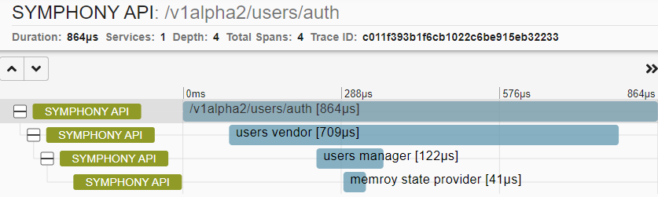

# Distributed tracing

Symphony supports automatic management plane distributed tracing through it’s [tracing middleware](../bindings/tracing.md).

## Configure console exporter

The console exporter outputs tracing spans to the terminal console. It's an easy way to test if tracing middleware is working. However, it's not suggested to use in production.

Configure your [HTTP binding](../bindings/http-binding.md) to include a tracing middleware with the console exporter:

```json
{
  "type": "middleware.http.tracing",
  "properties": {
    "pipeline": [
      {
        "exporter" : {
          "type": "tracing.exporters.console",
          "backendUrl": "",
          "sampler": {
            "sampleRate": "always"
          }
        }
      }
    ]
  }
}
```

## Configure Zipkin exporter

To launch a local Zipkin container for testing purposes, use:

```bash
docker run --rm -d -p 9411:9411 --name zipkin openzipkin/zipkin
```

Configure your [HTTP binding](../bindings/http-binding.md) to include a tracing middleware with the Zipkin exporter:

```json
{
  "type": "middleware.http.tracing",
  "properties": {
    "pipeline": [
      {
        "exporter" : {
          "type": "tracing.exporters.zipkin",
          "backendUrl": "http://localhost:9411/api/v2/spans",
          "sampler": {
            "sampleRate": "always"
          }
        }
      }
    ]
  }
}
```

Once the container is running, you can access Zipkin UI at: `http://localhost:9411/zipkin/` to view Symphony traces.


