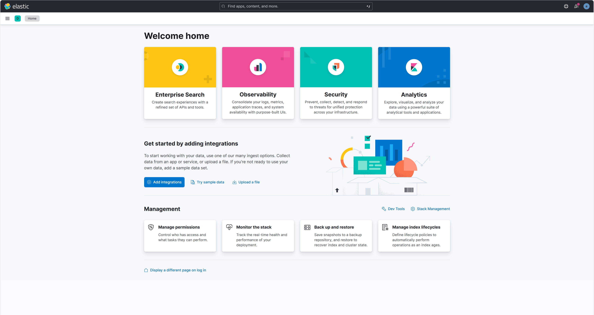
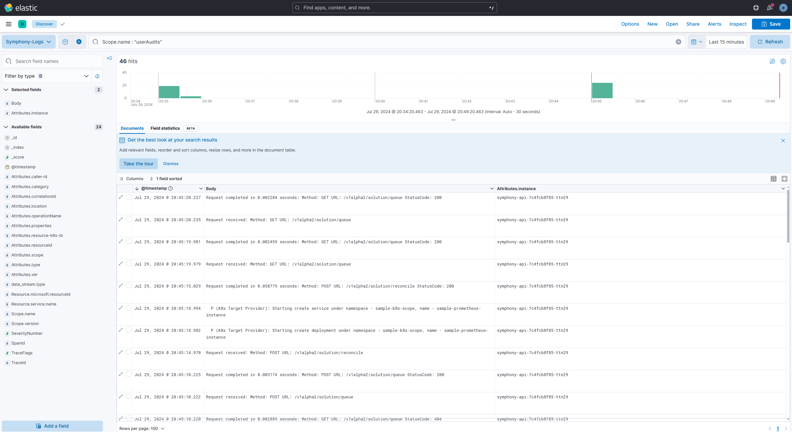
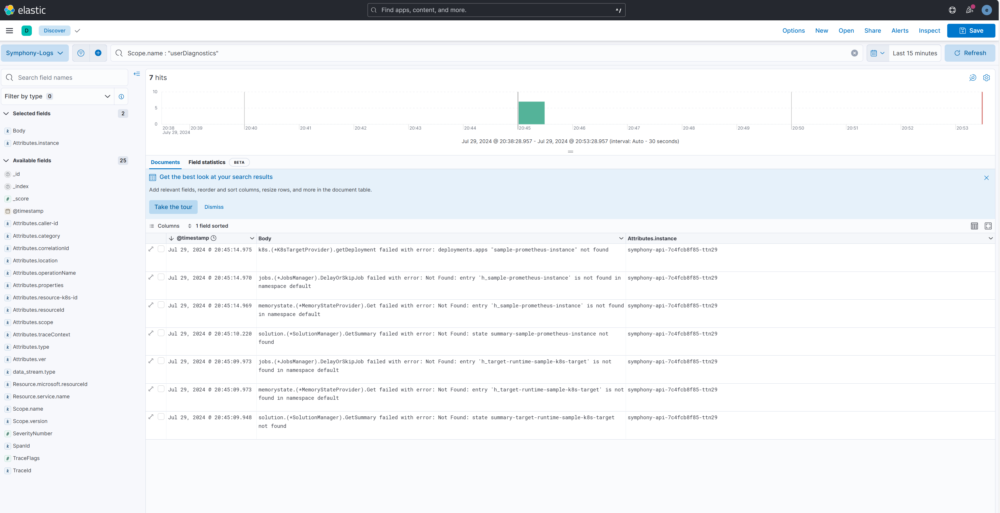
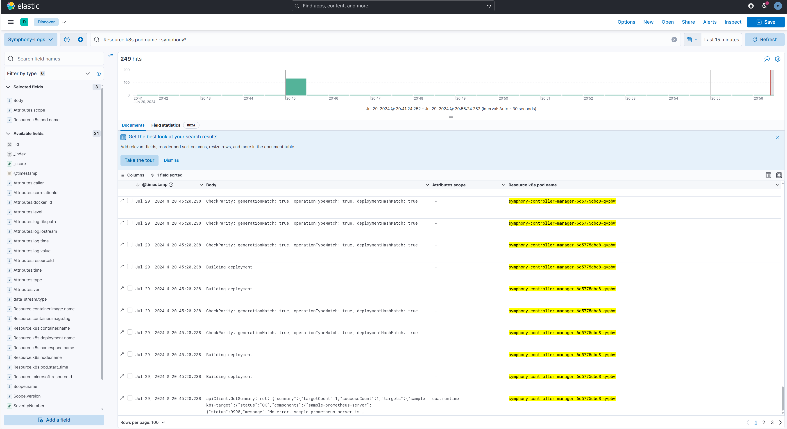

# Analyze Symphony logs

Symphony offers three kind of logs:

Log Type | Purpose | How to emit | How to collect
--- | --- | --- | ---
Application runtime logs | This prints the code flow and detailed diagnostics information of Symphony-controller and Symphony-api. Developers could leverage these logs to understand the detailed flow of each request. | Write to console (by logrus, zaplogger, fmt.print etc.) | Container logs or otel-collector (file receiver)
User audits logs | Symphony-controller and Symphony-api take use of the user-information and external operation information supplied by external system (e.g. Azure Cloud) to print the necessary auditing information to end-users.  | otelhttp | otel-collector (otlp receiver)
User diagnostics logs | Symphony-controller and Symphony-api take use of the user-information and external operation information supplied by external system (e.g. Azure Cloud) to print the necessary diagnostics information to end-users. | otelhttp | otel-collector (otlp receiver)


## Samples of Symphony logs

### Application runtime logs

1. Symphony-controller

```json
{"level":"info","time":"2024-07-29T10:23:27.446Z","caller":"/k8s/controllers/fabric/target_controller.go:77","msg":"Reconcile Target sample-k8s-target in namespace default","controller":"target","controllerGroup":"fabric.symphony","controllerKind":"Target","Target":{"name":"sample-k8s-target","namespace":"default"},"namespace":"default","name":"sample-k8s-target","reconcileID":"dbb2b4a8-069e-4205-ae11-d03f88b241f9"}
```

Log column | Descriptions
--- | ---
time | timestamp
level | log_level
caller | the function which prints the logs
msg | log_message
additional columns | controller, controllerGroup, controllerKind, namespace, reconcileID, name, etc, which indicates the essential information in reconcilation.

2. Symphony-api

```json
{"caller":"github.com/eclipse-symphony/symphony/api/pkg/apis/v1alpha1/providers/target/k8s.(*K8sTargetProvider).upsertService:576","diagnostics":{"correlationId":"6622ec13-ce88-496b-8194-31675c73535d","resourceId":"","traceContext":{"spanId":"43541c6b6fbc10dd","traceId":"0f24f33305fda69766d29fadab8a5732"}},"instance":"symphony-api-7c4fcb8f85-jms6v","level":"info","msg":"  P (K8s Target Provider): upsertService namespace - sample-k8s-scope, name - sample-prometheus-instance","scope":"providers.target.k8s","time":"2024-07-29T10:23:32.511871252Z","type":"log","ver":"unknown"}
```
Log column | Descriptions
--- | ---
time | timestamp
level | log_level
caller | the function which prints the logs
msg | log_message
instance | container name (in K8S) or computer name (in standalone)
type | log_type
ver | version info
scope | log_detailed_scope
diagnostics | diagnostics context (absent if no diagnostics context is initalized)

Diagnostics context column | Descriptions
--- | ---
correlationId | the external correlation id provided by external system (e.g. Azure Cloud), if it is missing when the request arrives to binding, the http/mqtt binding will assign a ramdon value
resourceId | the external system resource id (e.g. Azure Cloud resource id)
traceContext.traceId | the trace id if otel-tracing is enabled
traceContext.spanId | the span id if otel-tracing is enabled

### User audits logs

```
# Otel format
LogRecord #9
ObservedTimestamp: 2024-07-28 18:05:39.584374129 +0000 UTC
Timestamp: 2024-07-28 18:05:39.584361729 +0000 UTC
SeverityText: 
SeverityNumber: Trace4(4)
Body: Str(  P (Helm Target): Uninstalling chart name: e4k, namespace: alice-springs)
Attributes:
     -> scope: Str(coa.runtime.user.audits)
     -> resourceId: Str()
     -> category: Str(Activity)
     -> caller-id: Str()
     -> correlationId: Str(2c37ddcd-96e8-4478-9ab4-eb6ed15bb553)
     -> resource-k8s-id: Str(default/self)
     -> properties: Str({})
     -> type: Str(userAudits)
     -> instance: Str(symphony-api-6b9b548b5b-fmggp)
     -> ver: Str(unknown)
     -> operationName: Str(targets.fabric.symphony/Write)
     -> location: Str()
Trace ID: 
Span ID: 
Flags: 0
```
Log column | Descriptions
--- | ---
scope | coa.runtime.user.audits (indicating this is user audits logs)
resourceId | external system resource id (e.g. Azure Cloud resource id.)
category | audit operation category
caller-id | who invokes this operation
correlationId | the external correlation id provided by external system (e.g. Azure Cloud), if it is missing when the request arrives to binding, the http/mqtt binding will assign a ramdon value
resource-k8s-id | k8s resource id (namespace/resourceName)
properties | additional auditing properties
type | log type (userAudits)
instance | container name (in K8S) or computer name (in standalone)
ver | version
operationName | audit operation name
location | external system location (e.g. Azure Cloud location)
body | audit messages

### User diagnostics logs
```
LogRecord #0
ObservedTimestamp: 2024-07-28 18:05:45.817842889 +0000 UTC
Timestamp: 2024-07-28 18:05:45.817826388 +0000 UTC
SeverityText: 
SeverityNumber: Trace2(2)
Body: Str(memorystate.(*MemoryStateProvider).Get failed with error: Not Found: entry 'h_instance' is not found in namespace default)
Attributes:
     -> location: Str()
     -> category: Str(Activity)
     -> properties: Str({})
     -> scope: Str(coa.runtime.user.diagnostics)
     -> type: Str(userDiagnostics)
     -> correlationId: Str(8ca7ba3a-4353-4c2e-9a95-74396220b462)
     -> operationName: Str(instances.solution.symphony/Write)
     -> caller-id: Str()
     -> resource-k8s-id: Str(default/instance)
     -> instance: Str(symphony-api-6b9b548b5b-fmggp)
     -> ver: Str(unknown)
     -> resourceId: Str()
     -> traceContext: Str({"spanId":"","traceId":""})
Trace ID: 
Span ID: 
Flags: 0
```

Log column | Descriptions
--- | ---
scope | coa.runtime.user.diagnostics (indicating this is user diagnostics logs)
resourceId | external system resource id (e.g. Azure Cloud resource id.)
category | audit operation category
caller-id | who invokes this operation
correlationId | the external correlation id provided by external system (e.g. Azure Cloud), if it is missing when the request arrives to binding, the http/mqtt binding will assign a ramdon value
resource-k8s-id | k8s resource id (namespace/resourceName)
properties | additional auditing properties
type | log type (userDiagnostics)
instance | container name (in K8S) or computer name (in standalone)
ver | version
operationName | audit operation name
location | external system location (e.g. Azure Cloud location)
body | audit messages
traceContext | otel-tracing trace context

## Log coverage

Log Type | How to emit
--- | --- 
Application runtime logs | All console outputs in Symphony-api and Symphony-controller. 
User audits logs | Any places which invokes `logger.GetUserAuditsLogger.xxx` (added in essential target providers and validation webhooks)
User diagnostics logs | Any places which invokes `logger.GetUserDiagnosticsLogger.xxx` (added in major functions, defer functions when return error is not nil)

## Log context

We introduces log context in [logger interface](../../../coa/pkg/logger/logger.go). 

```go
	// Info logs a message at level Info.
	InfoCtx(ctx context.Context, args ...interface{})
	// Infof logs a message at level Info.
	InfofCtx(ctx context.Context, format string, args ...interface{})
	// Debug logs a message at level Debug.
	DebugCtx(ctx context.Context, args ...interface{})
	// Debugf logs a message at level Debug.
	DebugfCtx(ctx context.Context, format string, args ...interface{})
	// Warn logs a message at level Warn.
	WarnCtx(ctx context.Context, args ...interface{})
	// Warnf logs a message at level Warn.
	WarnfCtx(ctx context.Context, format string, args ...interface{})
	// Error logs a message at level Error.
	ErrorCtx(ctx context.Context, args ...interface{})
	// Errorf logs a message at level Error.
	ErrorfCtx(ctx context.Context, format string, args ...interface{})
	// Fatal logs a message at level Fatal then the process will exit with status set to 1.
	FatalCtx(ctx context.Context, args ...interface{})
	// Fatalf logs a message at level Fatal then the process will exit with status set to 1.
	FatalfCtx(ctx context.Context, format string, args ...interface{})
```

The context is passed through invoking flow. 
When the context includes [DiagnosticsContext](../../../coa/pkg/logger/contexts/diagnosticslog-context.go), the default logger (created by [`NewLogger`](../../../coa/pkg/logger/logger.go)) and user diagnostics logger (created by [`GetUserDiagnosticsLogger`](../../../coa/pkg/logger/logger.go)) will invoke logrus context-hook to decreate the diagnostics context information to log entry. 
In diagnostics context information, the correlation id, external system resource id, trace id and span id will be inherited from parent context to child in invoking flow.

When the context includes [ActiviatyContext](../../../coa/pkg/logger/contexts/activitylog-context.go), the user audits logger (created by [`GetUserAuditsLogger`](../../../coa/pkg/logger/logger.go)) will invoke logrus context-hook to decreate the activity context information to log entry.
In activity context information, the information related to operations will be inherited from parent context to child in invoking flow.

> [Attention!] For Symphony developers, better always use `xxxCtx(ctx, xxxx)` method to print logs. 

## Otel log integration

User audits and user diganostics logs are integrated with OTLP via [log bridge API](https://opentelemetry.io/docs/specs/otel/logs/bridge-api/). In http binding initialization in symphony-api and the bootstrap in symphony-controller. Sample symphony-api config of otel integration in user audits and user diagnostics logs.
```json
{
  "serviceName": "symphony-k8s",
  "pipelines": [
    {{- if .Values.otlpLogsEndpointGrpc }}
    {{- if .Values.observability.otelForwarder.enabled }}
    {
      "exporter": {
        "type": "log.exporters.otlphttp",
        "collectorUrl": "http://{{- include "symphony.fullname" . -}}-otel-forwarder-service.{{ .Release.Namespace }}.svc.cluster.local:4318/v1/logs"
      }
    }
    {{- else }}
    {
      "exporter": {
        "type": "log.exporters.otlphttp",
        "collectorUrl": "http://{{- include "symphony.fullname" . -}}-otel-collector-service.{{ .Release.Namespace }}.svc.cluster.local:4318/v1/logs"
      }
    }
    {{- end }}
    {{- end }}
  ]
}
```

Because application runtime logs are emitted by logrus, zaplogger or event fmt.print method, to collect as much logs as possible, to integrate application runtime logs with OTLP, we need to launch open telemetry collector with file receiver.

Sample: [symphony-otel-forwarder.yaml](../../../packages/helm/symphony/templates/symphony-core/symphony-otelforwarder.yaml)

## Deplay Symphony with advanced log experience

1. Enable application runtime logs, user diagnostics logs and user audits logs integration with default [open telemetry collector](https://opentelemetry.io/docs/collector/).

```yaml
# values.yaml
observability:
  otelCollector:
    enabled: true
  otelForwarder:
    enabled: true
otlpLogsEndpointGrpc: symphony-otel-collector-service.<REPLACE_NAMESPACE_HERE>.svc:4317
otlpInsecureGrpc: true 
```

```shell
helm install symphony oci://ghcr.io/eclipse-symphony/helm/symphony --version <version> -f values.yaml
```

Then you can dump all otel logs by `"kubectl logs 'deployment/symphony-otel-collector' --all-containers -n <REPLACE_NAMESPACE_HERE>`.

2. If you want to export the logs to other destinations. It is recommended to setup your own open telemetry collector with suitable exporters. Below shows an example of using ELK to explorer Symphony logs.

### Prerequisites: Setup ELK

1. Setup your own ELK cluster (e.g., create an Azure Kubernetes Cluster).

2. Install ElasticSearch on AKS

```shell
helm repo add elastic https://helm.elastic.co
helm repo update
helm install elasticsearch elastic/elasticsearch --set service.type=LoadBalancer

# 1. Watch all cluster members come up.
#   $ kubectl get pods --namespace=default -l app=elasticsearch-master -w
# 2. Retrieve elastic user's password.
#   # Username is "elastic"
#   $ kubectl get secrets --namespace=default elasticsearch-master-credentials -ojsonpath='{.data.password}' | base64 -d
# 3. Test cluster health using Helm test.
#   $ helm --namespace=default test elasticsearch

```
3. Install Kibana on AKS
```shell
helm install kibana elastic/kibana --set service.type=LoadBalancer

# 1. Watch all containers come up.
#   $ kubectl get pods --namespace=default -l release=kibana -w
# 2. Retrieve the elastic user's password.
#   # Username is "elastic"
#   $ kubectl get secrets --namespace=default elasticsearch-master-credentials -ojsonpath='{.data.password}' | base64 -d
# 3. Retrieve the kibana service account token.
#   $ kubectl get secrets --namespace=default kibana-kibana-es-token -ojsonpath='{.data.token}' | base64 -d
```

4. Find the ElasticSearch and Kibana endpoint

```
$ kubectl get service
NAME                            TYPE           CLUSTER-IP    EXTERNAL-IP        PORT(S)                         AGE
elasticsearch-master            LoadBalancer   x.x.x.x       <ES External IP>   9200:32538/TCP,9300:30693/TCP   8h
elasticsearch-master-headless   ClusterIP      None          <none>             9200/TCP,9300/TCP               8h
kibana-kibana                   LoadBalancer   x.x.x.x       <KB External IP>   5601:30170/TCP                  8h
kubernetes                      ClusterIP      10.0.0.1      <none>             443/TCP                         8h
```

5. Open Kibana dashboard - `http://<KB External IP>:5601`



### Setup your owner otel collector with elastic search exporter

Copy templates/otel-elk.template.yaml to otel-elk.yaml, and replace `<ES External IP>` and `<ES password>`.

```shell
kubectl apply -f otel-elk.yaml
```

### Point to Symphony helm chart to your own otel collector

```yaml
# values.yaml
observability:
  otelCollector:
    enabled: false
  otelForwarder:
    enabled: true
otlpLogsEndpointGrpc: <Your otel collector endpoint>:4317
otlpInsecureGrpc: true 
```

```shell
helm install symphony oci://ghcr.io/eclipse-symphony/helm/symphony --version <version> -f values.yaml
```

### Search logs in Kibana

1. Search user audits logs



2. Search user diagnostics logs



3. Search application runtime logs

