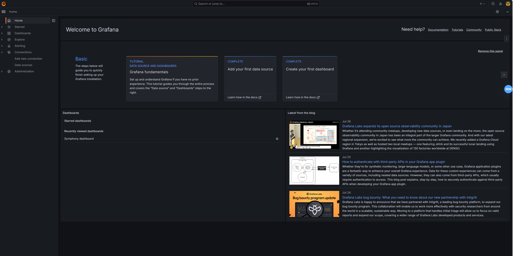
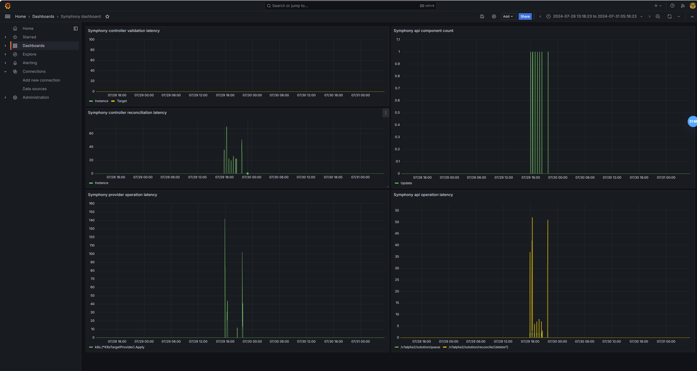

# Analyze Symphony Metrics

Symphony offers below kinds of metrics:

Metrics Type | Meter Type | Purpose | How to emit | How to collect
--- | --- | --- | --- | ---
symphony_api_operation_latency | Gauge | measure of overall latency for API operation side | otelgrpc | otel-collector
symphony_api_operation_errors | Counter | count of errors in API operation side | otelgrpc | otel-collector
symphony_api_component_count | Gauge | count of components in API operation | otelgrpc | otel-collector
symphony_provider_operation_latency | Gauge | measure of overall latency for provider operation side | otelgrpc | otel-collector
symphony_provider_operation_errors | Counter | count of errors in provider operation side | otelgrpc | otel-collector
symphony_controller_validation_latency | Gauge | measure of overall controller validate latency | otelgrpc | otel-collector
symphony_controller_reconcile_latency | Gauge | measure of overall latency for controller operation side | otelgrpc | otel-collector

Reference: [meters in open-telemetry](https://opentelemetry.io/docs/specs/otel/metrics/data-model/#metric-points)

## Samples of Symphony metrics

1. symphony_api_operation_latency (units: ms)

```
ScopeMetrics #1
ScopeMetrics SchemaURL: 
InstrumentationScope symphony_api 
Metric #0
Descriptor:
     -> Name: symphony_api_operation_latency
     -> Description: measure of overall latency for API operation side
     -> Unit: 
     -> DataType: Gauge
NumberDataPoints #0
Data point attributes:
     -> operation: Str(/v1alpha2/solution/reconcile/{delete?})
     -> operationType: Str(POST)
StartTimestamp: 2024-07-28 18:03:09.428680944 +0000 UTC
Timestamp: 2024-07-28 18:03:10.428197305 +0000 UTC
Value: 4.000000
NumberDataPoints #1
Data point attributes:
     -> operation: Str(/v1alpha2/solution/queue)
     -> operationType: Str(POST)
StartTimestamp: 2024-07-28 18:03:09.428680944 +0000 UTC
Timestamp: 2024-07-28 18:03:10.428197305 +0000 UTC
Value: 2.000000
```

2. symphony_api_operation_errors
```
...
Metric #1
Descriptor:
     -> Name: symphony_api_operation_errors
     -> Description: count of errors in API operation side
     -> Unit: 
     -> DataType: Sum
     -> IsMonotonic: false
     -> AggregationTemporality: Delta
NumberDataPoints #0
Data point attributes:
     -> errorCode: Str(Not Found)
     -> operation: Str(/v1alpha2/solution/queue)
     -> operationType: Str(GET)
StartTimestamp: 2024-07-28 18:03:09.428681744 +0000 UTC
Timestamp: 2024-07-28 18:03:10.428198305 +0000 UTC
Value: 2.000000
```

3. symphony_api_component_count
```
ScopeMetrics #0
ScopeMetrics SchemaURL: 
InstrumentationScope symphony-api 
Metric #0
Descriptor:
     -> Name: symphony_api_component_count
     -> Description: count of components in API operation
     -> Unit: 
     -> DataType: Gauge
NumberDataPoints #0
Data point attributes:
     -> operation: Str(Reconcile)
     -> operationType: Str(Update)
StartTimestamp: 2024-07-28 18:03:14.42806339 +0000 UTC
Timestamp: 2024-07-28 18:03:15.428296768 +0000 UTC
Value: 2.000000
```

4. symphony_provider_operation_latency (units: ms)
```
ScopeMetrics #0
ScopeMetrics SchemaURL: 
InstrumentationScope symphony-api 
Metric #0
Descriptor:
     -> Name: symphony_provider_operation_latency
     -> Description: measure of overall latency for provider operation side
     -> Unit: 
     -> DataType: Gauge
NumberDataPoints #0
Data point attributes:
     -> functionName: Str(Update)
     -> operation: Str(helm.(*HelmTargetProvider).Apply)
     -> operationType: Str(Apply)
     -> providerType: Str(helm)
StartTimestamp: 2024-07-28 18:03:17.430333036 +0000 UTC
Timestamp: 2024-07-28 18:03:18.433396098 +0000 UTC
Value: 2274.000000
```

5. symphony_provider_operation_errors
```
Todo...
```

6. symphony_controller_validation_latency
```
...
Metric #1
Descriptor:
     -> Name: symphony_controller_validation_latency
     -> Description: measure of overall controller validate latency
     -> Unit: 
     -> DataType: Gauge
NumberDataPoints #0
Data point attributes:
     -> resourceType: Str(Target)
     -> validationResult: Str(Valid)
     -> validationType: Str(Update)
StartTimestamp: 2024-07-28 18:03:11.101184359 +0000 UTC
Timestamp: 2024-07-28 18:03:12.101742544 +0000 UTC
Value: 0.000000
```

7. symphony_controller_reconcile_latency
```
ScopeMetrics #0
ScopeMetrics SchemaURL: 
InstrumentationScope symphony-k8s 
Metric #0
Descriptor:
     -> Name: symphony_controller_reconcile_latency
     -> Description: measure of overall latency for controller operation side
     -> Unit: 
     -> DataType: Gauge
NumberDataPoints #0
Data point attributes:
     -> chartVersion: Str(1.0.53-buddy-20240728.2)
     -> operationStatus: Str(DeploymentSucceeded)
     -> reconciliationResult: Str(Succeeded)
     -> reconciliationType: Str(Update)
     -> resourceType: Str(Instance)
StartTimestamp: 2024-07-28 18:03:20.101602889 +0000 UTC
Timestamp: 2024-07-28 18:03:21.10144388 +0000 UTC
Value: 12.000000
```

## Otel metrics integration

Symphony metrics are integarted with OTLP via [Metrics API](https://opentelemetry.io/docs/specs/otel/metrics/api/). In http binding initialization in symphony-api and the bootstrap in symphony-controller. Sample symphony-api config of otel integration in Symphony metrics.

```json
{
    "serviceName": "symphony-k8s",
    "pipelines": [
    {{- if .Values.otlpMetricsEndpointGrpc }}
    {
        "exporter": {
          "type": "metrics.exporters.otlpgrpc",
          "collectorUrl": "{{ tpl .Values.otlpMetricsEndpointGrpc $ }}",
          "temporality": true,
          "insecureEndpoint": true
        }
    }
    {{- end }}
    ]
}
```

### Deploy Symphony with advanced metrics experince

1. Enable Symphony metrics integration with default [open telemetry collector](https://opentelemetry.io/docs/collector/).

```yaml
# values.yaml
observability:
  otelCollector:
    enabled: true
  otelForwarder:
    enabled: true
otlpMetricsEndpointGrpc: symphony-otel-collector-service.<REPLACE_NAMESPACE_HERE>.svc:4317
otlpInsecureGrpc: true 
```

```shell
helm install symphony oci://ghcr.io/eclipse-symphony/helm/symphony --version <version> -f values.yaml
```

Then you can dump all otel metrics by `"kubectl logs 'deployment/symphony-otel-collector' --all-containers -n <REPLACE_NAMESPACE_HERE>`.

2. Inf you want to export otel metrics to other destinations. It is recommended to setup your own open telemetry collector with suitable exporters. Below shows an example of using Prometheus to explorer Symphony metrics.

### Prerequisites: Setup Prometheus 

kube-prometheus: https://github.com/prometheus-operator/kube-prometheus

```shell
git clone https://github.com/prometheus-operator/kube-prometheus.git
```

```shell
# navigate to repo root
kubectl apply --server-side -f manifests/setup
kubectl wait \
	--for condition=Established \
	--all CustomResourceDefinition \
	--namespace=monitoring
kubectl apply -f manifests/
```

The default username/password of grafana in kube-prometheus is admin/admin. (Will prompt you to change the password in first login).

```shell
kubectl --namespace monitoring port-forward svc/grafana 3000
```

Open Grafana dashboard - `http://localhost:3000`




### Setup your own otel collector with prometheus exporter

Copy templates/otel-prom.template.yaml to otel-prom.yaml.

```shell
kubectl apply -f otel-prom.yaml
```

### Setup scrape in Prometheus

https://github.com/prometheus-operator/prometheus-operator/blob/main/Documentation/additional-scrape-config.md


Copy templates/prometheus-additional.yaml to prometheus-additional.yaml.

```shell
# modify the scrape targets endpoints according to your otel collector service endpoint
kubectl create secret generic additional-scrape-configs --from-file=prometheus-additional.yaml --dry-run=client -oyaml > additional-scrape-configs.yaml

kubectl apply -f additional-scrape-configs.yaml -n monitoring
```
Finally, reference this additional configuration in your prometheus CRD.

```shell
kubectl get prometheus -A
NAMESPACE    NAME   VERSION   DESIRED   READY   RECONCILED   AVAILABLE   AGE
monitoring   k8s    2.53.0    2         2       True         True        4h3m
```


```shell
kubectl edit prometheus -n monitoring

# Add below lines in the end of spec section, then save.
spec:
  ...
  additionalScrapeConfigs:
    name: additional-scrape-configs
    key: prometheus-additional.yaml

```

### Point to Symphony helm chart to your own otel collector

```yaml
# values.yaml
observability:
  otelCollector:
    enabled: false
  otelForwarder:
    enabled: false
otlpMetricsEndpointGrpc: <Your otel collector endpoint>:4317
otlpInsecureGrpc: true 
```

```shell
helm install symphony oci://ghcr.io/eclipse-symphony/helm/symphony --version <version> -f values.yaml
```

### Observe metrics in Grafana


