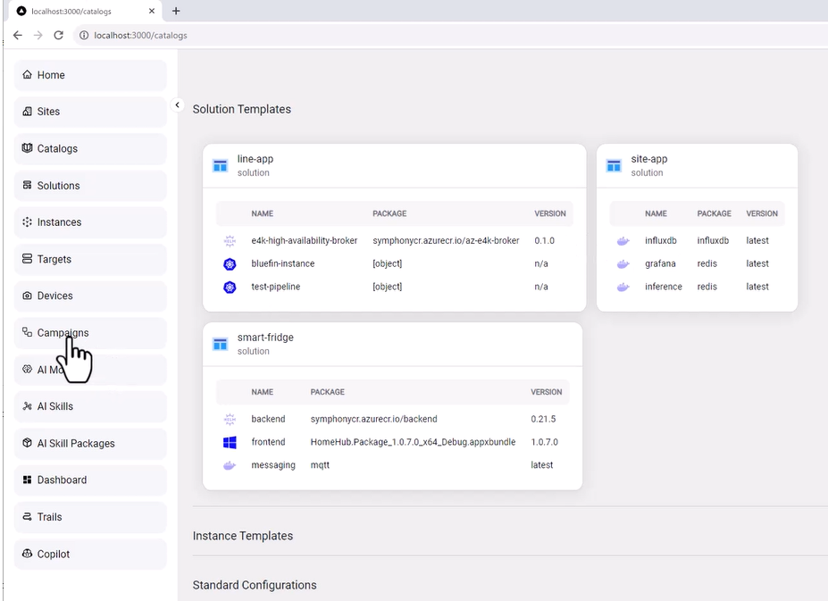

# Symphony Portal Experiences

The Symphony API is intentionally designed to be simple and agnostic. The anticipation is that more opinionated experiences can be built on top Symphony API to provide streamlined experiences tailored for specific use cases and payload types. There have been multiple user experiences built on top of Symphony, two of which are publicly available:

* The KubeAI Application Nucleus for edge (KAN)  project uses Symphony as its backend API. It provides an intuitive portal experience for users to create and deploy artificial intelligence solutions, especially computer-vision solutions, at edge.

* The [Opera portal](../../samples/opera/README.md) is shipped as a sample under the Symphony repository. It demonstrates key elements of building a custom portal using the Symphony API.

