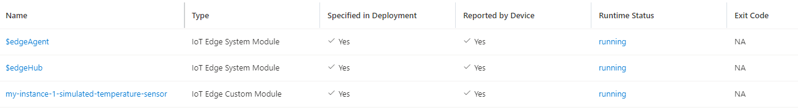

# Symphony Quick Start - Deploying a simulated temperature sensor Solution to an Azure IoT Edge device
This quick start walks you through the steps of deploying a new Symphony solution instance to an Azure IoT Edge device.

> **NOTE**: The following steps are tested under a Ubuntu 20.04.4 TLS WSL system on Windows 11. However, they should work for Linux, Windows, and MacOS systems as well.


## Configure an IoT Edge device

### 1. Register an IoT Edge device

These steps create a new resource group, a new IoT Hub, and a new IoT Edge device.

```bash
# install Azure IoT extension if needed
az extension add --name azure-iot

# create resource grouop
az group create --name s8c-demo --location westus2

# create IoT Hub
az iot hub create --name s8chub --resource-group s8c-demo --sku S1

# create a IoT Edge device
az iot hub device-identity create --device-id s8c-vm --hub-name s8chub --edge-enabled

# get IoT Edge device connection string
az iot hub device-identity connection-string show --device-id s8c-vm --resource-group s8c-demo --hub-name s8chub
```

### 2. Configure a Linux VM as your IoT Edge device
You need to prepare a Linux virtual machine or physical device for IoT Edge. In this guide, you create a Linux VM. You can use an ARM deployment to automate these steps, or use the Azure CLI.

* ARM deployment steps:

  ```bash
  # use ARM deployment to create a VM and install IoT Edge runtime
  az deployment group create \
  --resource-group s8c-demo \
  --template-uri "https://raw.githubusercontent.com/Azure/iotedge-vm-deploy/1.4/edgeDeploy.json" \
  --parameters dnsLabelPrefix='s8c-vm' \
  --parameters adminUsername='hbai' \
  --parameters deviceConnectionString=$(az iot hub device-identity connection-string show --device-id s8c-vm --hub-name s8chub -o tsv) \
  --parameters authenticationType='password' \
  --parameters adminPasswordOrKey="<REPLACE_WITH_PASSWORD>"
  ```

* Azure CLI steps:

  ```bash
  # create vm
  az vm create --resource-group s8c-demo --name s8c-vm --image UbuntuLTS --admin-username hbai --generate-ssh-keys --size Standard_D2s_v5

  # SSH into the machine
  ssh hbai@<public IP of your VM>

  # update repo and signing key
  wget https://packages.microsoft.com/config/ubuntu/18.04/multiarch/packages-microsoft-prod.deb -O packages-microsoft-prod.deb
  sudo dpkg -i packages-microsoft-prod.deb
  rm packages-microsoft-prod.deb

  # install container engine
  sudo apt-get update; \
    sudo apt-get install moby-engine

  # install IoT Edge engine runtime
  sudo apt-get update; \
    sudo apt-get install aziot-edge defender-iot-micro-agent-edge

  # update iotedge setting
  sudo iotedge config mp --connection-string '<IoT Edge device connection string>'
  ```

## OPTION 1: Use Maestro

To use this option, first install Maestro and the Symphony API. For more information, see [Use Symphony with the Maestro CLI tool](./quick_start_maestro.md).

Once you have maestro installed, you can launch this sample with the following command:

```bash
maestro samples run hello-iot-edge --set iot-hub-key=<IoT Hub key> --set iot-hub-name=<IoT Hub name> --set device-name=<IoT Edge device name>
```

To clean up, use:

```
maestro samples remove hello-iot-edge 
```

## OPTION 2: Use Helm and Kubectl

### 0. Prerequisites

* [kubectl](https://kubernetes.io/docs/reference/kubectl/kubectl/) is configured with the Kubernetes cluster you want to use as the default context
* [Azure CLI](https://docs.microsoft.com/en-us/cli/azure/)

### 1. Register the IoT Edge device as a Symphony Target

A Symphony *target* is a specific deployment environment that inculdes definitions of infrastructural components and types of resources to be managed.

Create a YAML file called `target.yaml` that registers the IoT Edge device as a Symphony target:

```yaml
apiVersion: fabric.symphony/v1
kind: Target
metadata:
  name: sample-iot-edge-target
spec:  
  forceRedeploy: true
  topologies:
  - bindings:
    - role: instance
      provider: providers.target.azure.iotedge
      config:
        name: "iot-edge"
        keyName: "<IoT Hub Key Name>"
        key: "<IoT Hub Key>"
        iotHub: "<IoT Hub Name>"
        apiVersion: "2020-05-31-preview"
        deviceName: "<Device Name>"
```

This YAML file is also available at [docs/samples/iot-edge/simulated-temperature-sensor/target.yaml](../../samples/iot-edge/simulated-temperature-sensor/target.yaml).

### 2. Create the Symphony Solution

A Symphony *solution* is a template that defies an application workload to be deployed on one or more *targets*.

Create a YAML file called `solution.yaml` that describes a Symphony Solution with a single component, which is based on the `mcr.microsoft.com/azureiotedge-simulated-temperature-sensor:1.0` container.

```yaml
apiVersion: solution.symphony/v1
kind: Solution
metadata:
  name: sample-simulated-temperature-sensor
spec:
  components:
  - name: "simulated-temperature-sensor"
    properties:
      container.version: "1.0"
      container.type: "docker"
      container.image: "mcr.microsoft.com/azureiotedge-simulated-temperature-sensor:1.0"
      container.createOptions: ""
      container.restartPolicy: "always"      
    routes:
    - route: SimulatedTemperatureSensorToIoTHub
      type: iothub
      properties:
        definition: "FROM /messages/modules/simulated-temperature-sensor/* INTO $upstream"
```

This YAML file is also available at [docs/samples/iot-edge/simulated-temperature-sensor/solution.yaml](../../samples/iot-edge/simulated-temperature-sensor/solution.yaml).

### 3. Create the Symphony Solution Instance

A Symphony *solution instance* maps a *solution* to one or multiple *targets*. 

Create a YAML file called `instance-1.yaml` that maps the `sample-simulated-temperature-sensor` soltuion to the `sample-iot-edge-target` target above:

> **NOTE**: You can get a sample of this file under ``````:
```yaml
apiVersion: solution.symphony/v1
kind: Instance
metadata:
  name: sample-iot-edge-instance-1
spec:
  solution: sample-simulated-temperature-sensor            
  target:
    name: sample-iot-edge-target
```

This YAML file is also available at [docs/samples/iot-edge/simulated-temperature-sensor/instance-1.yaml](../../samples/iot-edge/simulated-temperature-sensor/instance-1.yaml).

You can also create additional instances. Symphony does the following for each of the instances:
* It generates IoT Edge module with a `<instance id>-` prefix.
* It rewrites all IoT Edge route definitions in the solution so that messages are routed to the right instance module.

## Create all objects

```bash
kubectl create -f target.yaml
kubectl create -f solution.yaml
kubectl create -f instance-1.yaml
kubectl create -f instance-2.yaml # if you've defined additional instances
```

## Verify

Examine all Symphony objects have created:

```bash
kubectl get targets
kubectl get solutions
kubectl get instances
```

On IoT Hub page, verify all IoT Edge modules are up and running (screen shot shows only one instance):


## Clean up Symphony objects

To delete all Symphony objects:

```bash
kubectl delete instance my-instance-1
kubectl delete solution simulated-temperature-sensor
kubectl delete target voe-target
```