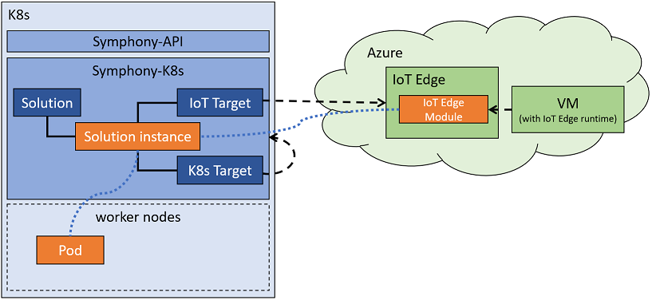

# Scenario: Adaptive Deployment

In this scenario, you'll deploy a [Solution](../uom/solution.md) to both a Kubernetes cluster and an Azure IoT Edge device at the same time. Symphony will automatically adapt the solution to fit with the corresponding platforms.



## Prerequisites

* An [Azure IoT Edge](https://azure.microsoft.com/en-us/products/iot-edge/) device (see instructions [here](../quick_start/deploy_solution_to_azure_iot_edge.md) for setting up a new Azure IoT Edge device).

## 1. Register targets
First, you need to register your IoT Edge device as a [Target](../uom/target.md):
```yaml
apiVersion: fabric.symphony/v1
kind: Target
metadata:
  name: iot-target
spec:  
  properties:
    group: demo
  topologies:
  - bindings:
    - role: instance
      provider: providers.target.azure.iotedge
      config:
        name: "iot-edge"
        keyName: "<IoT Hub key name>"
        key: "<IoT Hub Key>"
        iotHub: "<IoT Hub name>.azure-devices.net"
        apiVersion: "2020-05-31-preview"
        deviceName: "<IoT Edge device name>"
```
Then, you'll register your current Kubernetes cluster as the second [Target](../uom/target.md):
```yaml
apiVersion: fabric.symphony/v1
kind: Target
metadata:
  name: k8s-target
spec:  
  properties:
    group: demo
  topologies:
  - bindings:
    - role: instance
      provider: providers.target.k8s
      config:
        inCluster: "true"   
```
> **NOTE:** both targets are marked with a ```group: demo``` property, which you'll use as the target selector in your [Instance](../uom/instance.md) object.
## 2. Creation solution
Create a simple [Solution](../uom/solution.md) with a single component:
```yaml
apiVersion: solution.symphony/v1
kind: Solution
metadata: 
  name: redis-server
spec:  
  metadata:
    deployment.replicas: "#1"
    service.ports: "[{\"name\":\"port6379\",\"port\": 6379}]"
    service.type: "ClusterIP"
  components:
  - name: redis-server
    type: container
    properties:
      container.ports: "[{\"containerPort\":6379,\"protocol\":\"TCP\"}]"
      container.imagePullPolicy: "Always"
      container.resources: "{\"requests\":{\"cpu\":\"100m\",\"memory\":\"100Mi\"}}"        
      container.image: "docker.io/redis:6.0.5"
      container.version: "1.0"
      container.type: "docker"
```
## 3. Create instance
To deploy the solution to both targets, create a new [Instance](../uom/instance.md) object:
```yaml
apiVersion: solution.symphony/v1
kind: Instance
metadata:
  name: my-instance
spec:
  scope: basic-k8s
  solution: redis-server
  target:
    selector: 
      group: demo
      
```
> **NOTE:**: ```scope``` is optional. If used, your pods on Kubernetes will be deployed to the designated namepace.

Observe the solution is deployed on both targets:
```bash
kubectl get instance
NAME          STATUS   TARGETS   DEPLOYED
my-instance   OK       2         2
```

## 4. Clean up
```bash
kubectl delete instance my-instance
kubectl delete solution redis-server
kubectl delete target iot-target
kubectl delete target k8s-target
```