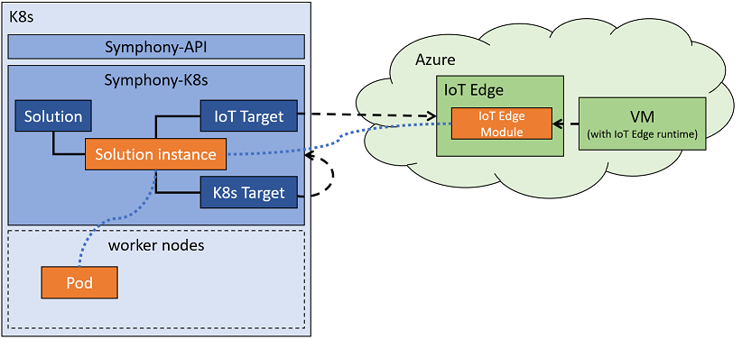

# Scenario: Adaptive deployment

In this scenario, you'll deploy a [solutionversion](../concepts/unified-object-model/solutionversion.md) to both a Kubernetes cluster and an Azure IoT Edge device at the same time. Symphony automatically adapts the solutionversion to fit with the corresponding platforms.



## Prerequisites

* An [Azure IoT Edge](https://azure.microsoft.com/ products/iot-edge/) device (see instructions [here](../get-started/deploy_solutionversion_to_azure_iot_edge.md) for setting up a new Azure IoT Edge device).

## 1. Register targets

First, register your IoT Edge device as a [target](../concepts/unified-object-model/target.md):

```yaml
apiVersion: fabric.symphony/v1
kind: Target
metadata:
  name: iot-target
spec:  
  properties:
    group: demo
  topologies:
  - bindings:
    - role: instance
      provider: providers.target.azure.iotedge
      config:
        name: "iot-edge"
        keyName: "<IoT Hub key name>"
        key: "<IoT Hub Key>"
        iotHub: "<IoT Hub name>.azure-devices.net"
        apiVersion: "2020-05-31-preview"
        deviceName: "<IoT Edge device name>"
```

Then, register your current Kubernetes cluster as a second target:

```yaml
apiVersion: fabric.symphony/v1
kind: Target
metadata:
  name: k8s-target
spec:  
  properties:
    group: demo
  topologies:
  - bindings:
    - role: instance
      provider: providers.target.k8s
      config:
        inCluster: "true"   
```

> **NOTE:** both targets are marked with a `group: demo` property, which you'll use as the target selector in your [instance](../concepts/unified-object-model/instance.md) object.

## 2. Create a solutionversion

Create a simple [solutionversion](../concepts/unified-object-model/solutionversion.md) with a single component:

```yaml
apiVersion: solutionversion.symphony/v1
kind: SolutionVersion
metadata: 
  name: redis-server
spec:  
  metadata:
    deployment.replicas: "#1"
    service.ports: "[{\"name\":\"port6379\",\"port\": 6379}]"
    service.type: "ClusterIP"
  components:
  - name: redis-server
    type: container
    properties:
      container.ports: "[{\"containerPort\":6379,\"protocol\":\"TCP\"}]"
      container.imagePullPolicy: "Always"
      container.resources: "{\"requests\":{\"cpu\":\"100m\",\"memory\":\"100Mi\"}}"        
      container.image: "docker.io/redis:6.0.5"
      container.version: "1.0"
      container.type: "docker"
```

## 3. Create an instance

To deploy the solutionversion to both targets, create an [instance](../concepts/unified-object-model/instance.md) object that applies the `redis-server` solutionversion to the `demo` group of targets:

```yaml
apiVersion: solutionversion.symphony/v1
kind: Instance
metadata:
  name: my-instance
spec:
  scope: basic-k8s
  solutionversion: redis-server
  target:
    selector: 
      group: demo      
```

> **NOTE:**: `scope` is optional. If used, your pods on Kubernetes will be deployed to the designated namespace.

Observe that the solutionversion is deployed on both targets:

```bash
kubectl get instance
NAME          STATUS   TARGETS   DEPLOYED
my-instance   OK       2         2
```

## 4. Clean up

```bash
kubectl delete instance my-instance
kubectl delete solutionversion redis-server
kubectl delete target iot-target
kubectl delete target k8s-target
```
