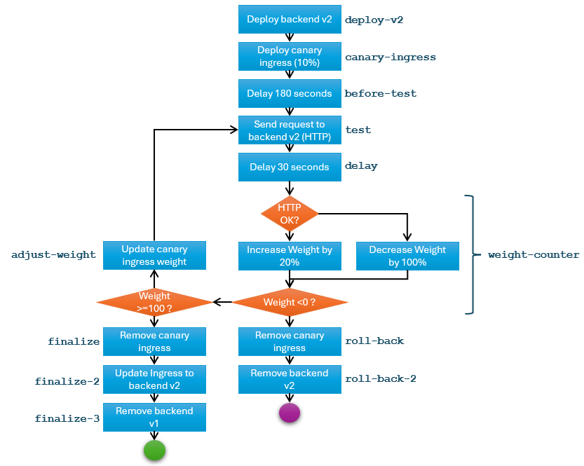

# Canary development

In this scenario, you deploy an application with a front end and a backend. As you roll out a new backend version, you do a canary deployment in which you send a small portion of the backend traffic to the new backend version, validate its quality, and gradually shift all traffic to the new backend (and rollback if validation fails).

## Model the application

You can model the application using a Symphony [solution](../concepts/unified-object-model/solution.md) object in several different ways:

* You can put the front-end, the backend (v1), as well as an ingress into the same solution definition as three components. When you need to roll out a new backend (v2), you patch the solution object to add a new backend (v2) component, and then add a canary ingress component to adjust traffic shape. During canary, you perform manual or automated validations and adjust the traffic shape by modifying the canary ingress definition.

* If you consider that ingress is an infrastructure component, you can move the ingress component to be a [target](../concepts/unified-object-model/target.md) object, or a separate solution object, so that it can be managed separately.

* If the front-end and the backend are managed by different teams, you can split them into different solutions.

## Generic flow

Regardless of how you model your application, the canary process is the same:

1. Deploy a new version.
2. Adjust traffic so that a certain percentage of traffic is sent to the new version. If everything is shifted to the new version, then the deployment is done. If everything is shifted back to the original version, then the deployment is rolled back.
3. Test the new version. Based on test results, either increment the weight of the new version, or reduce the weight of the new version and then return to step 2.

## Sample artifacts

You can find sample artifacts in this repository in the `docs/samples/canary` folder:

| Artifact | Purpose |
|--------|--------|
| [activation.yaml](../../samples/canary/activation.yaml) | Activate the canary workflow |
| [campaign.yaml](../../samples/canary/campaign.yaml) | Canary workflow definition |
| [instance.yaml](../../samples/canary/instance.yaml) | Initial application deployment (front-end + backend (v1)) |
| [solution.yaml](../../samples/canary/solution.yaml) | Initial application definition (front-end + backend (v1)) |
| [target.yaml](../../samples/canary/target.yaml) | Target definition (current K8s cluster) |

The following diagram illustrates how the stages in the canary workflow are defined, with corresponding stage names in `campaign.yaml`.



## Deployment steps

1. Deploy the original application (front-end + backend v1):

   ```bash
   kubectl apply -f target.yaml
   kubectl apply -f solution.yaml
   kubectl apply -f instance.yaml
   ```

1. Wait for the deployment to finish. You can monitor the progress with `kubectl get instance -w`. Initially, the instance is likely to fail, because Nginx Ingress controller takes time to initialize, causing `Ingress` creation to fail. The instance should return to a healthy state after a few minutes (after the next round of state reconciliation happens).

1. In a separate terminal window, attach to the front-end pod and ping the backend every second:

   ```bash
   kubectl exec -it <front-end pod name> /bin/bash
   # inside container
   while true; do curl http://<ingress IP address>/api/env/APP_VERSION; sleep 1; done
   ```

   Keep this terminal window open. You can observe how backend traffic is gradually shifted to v2 without interrupting the front-end.

1. Define and activate the campaign

   ```bash
   kubectl apply -f campaign.yaml
   kubectl apply -f activation.yaml
   ```

1. The campaign takes a few minutes to run. Eventually, you should see that all traffic is shifted to v2 in the above terminal window. Optionally, in a separate terminal window, you can examine various objects:

   ```bash
   # check how the solution is patched
   kubectl get solution test-app -o yaml
   # check how the canary ingress is configured (such as weight assignment)
   kubectl get ingress canary-ingress -o yaml
   ```

1. Once everything is done, check the final state of the objects:

   ```bash
   # check services, backend-v1 should have been removed
   kubectl get svc
   # check ingresses, canary-ingress should have been removed
   kubectl get ingress
   # check ingress, it should have been reconfigured to route all traffic to v2
   kubectl get ingress ingress -o yaml
   ```
