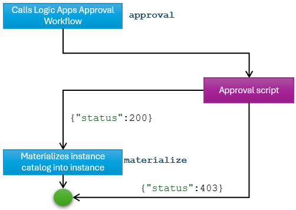

# Gated deployment (using script)

In this scenario, application deployment is carried out only after an approval script has executed with a ```status:200``` return value. 

## Generic flow

1. Define your application as a Symphony `solution` object, your deployment target as a Symphony `target` object.
2. Define your deployment topology as a Symphony `instance` object wrapped in a Symphony `catalog` object. 
    > **Note:** We use a catalog object instead of an instance object here because an instance object represents a desired state, which will trigger Symphony state reconciliation. In this case, however, we don’t want the state reconciliation to be triggered before approval. Hence, we capture the “intention of the desired state” in a catalog object. The intention will be “materialized” into an instance object only after approval.
3. Define your approval script and upload to a public storage location (such as Azure Blob Storage). A script returns a ```{"status":200}``` JSON payloads approves the deployment; a script returns a ```{"status":403}``` or returns an error rejects the deployment.

    > **NOTE:** There's a sample ```mock-reject.sh``` script and a ```mock-approve.sh``` script at ```https://raw.githubusercontent.com/eclipse-symphony/symphony/main/docs/samples/approval/script```.

4. To coordinate the approval process, define a Symphony `campaign` object that calls out to the above script and then drives application deployment.
5. Create an `activation` object to activate the campaign.

## Sample artifacts
You can find sample artifacts in this repository under the `docs/samples/approval/script` folder:
| Artifact | Purpose |
|--------|--------|
| [activation.yaml](../../samples/approval/script/activation.yaml) | Campaign activation |
| [campaign.yaml](../../samples/approval/script/campaign.yaml) | Campaign definition |
| [instance-catalog.yaml](../../samples/approval/script/instance-catalog.yaml) | Instance definition (wrapped in a catalog) |
| [mock-approve.sh](../../samples/approval/script/mock-approve.sh) | Mock script that always approves |
| [mock-reject.sh](../../samples/approval/script/mock-reject.sh) | Mock script that always rejects |
| [solution.yaml](../../samples/approval/script/solution.yaml) | Solution definition |
| [target.yaml](../../samples/approval/script/target.yaml) | Target definition |

The following diagram illustrates how the stages in the approval workflow are defined, with corresponding stage names in `campaign.yaml`.



## Deployment steps

1. Create you approval script. A script returns a ```{"status":200}``` JSON payload approves the deployment; a script returns a ```{"status":403}``` or returns an error rejects the deployment. This script needs to be uploaded to a public URL that allows anoynoums download. 

    > **NOTE**: A script returning a non-zero error code instead of `{“status”:403}` causes the campaign to fail. This has the same effect of a rejection in this case. But if you want to carry out additional steps – such as sending requestor a notification – your script needs to return a proper payload instead of throwing an error.

2. Modify your `campaign.yaml` file to point to the correct `scriptFolder` and `script` file name you want to use.

3. Create Symphony objects:
    ```bash
    kubectl apply -f solution.yaml
    kubectl apply -f target.yaml
    kubectl apply -f instance-catalog.yaml
    kubectl apply -f campaign.yaml
    ```
    > **NOTE**: When you use your current Kubernetes cluster as the target, make sure you don't register the same cluster multiple times (as different targets).
4. Activate the campaign:
    ```bash
    kubectl apply -f activation.yaml
    ```
5. If your campaign is configured to use the ```mock-approve.sh``` script, the deployment is automatically approved. If your campaign is configured to use the ```mock-reject.sh``` script, the deployment is always rejected.
    
6. Observe the instance is created and the sample application (Prometheus server) deployed:
    ```bash
    kubectl get instance  # the instance should be created and reconciled 
    NAME                        STATUS   TARGETS   DEPLOYED
    gated-prometheus-instance   Succeeded   1         1 

    kubectl get svc
    NAME                        TYPE           CLUSTER-IP       ...
    gated-prometheus-instance   LoadBalancer   10.107.68.41     ...
    ...
    ```
7. To clean up:
    ```bash
    kubectl delete instance gated-prometheus-instance
    kubectl delete activation approval-activation
    # at this point you can re-run the scenario by re-creating the activation object
    # to switch to a different script, update and apply the new campaign.yaml file
    ```
