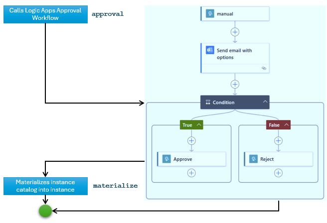

# Gated deployment

In this scenario, application deployment is carried out only after a designated approver has approved the operation. The approval workflow is implemented as an [Azure Logic Apps](https://learn.microsoft.com/en-us/azure/logic-apps/logic-apps-overview) workflow, which sends out an email to an approver with an Approval button and a Reject button. The approver approves the operation by clicking on the Approval button; otherwise, the deployment is blocked. 

## Generic flow

1. Define your application as a Symphony `solution` object, your deployment target as a Symphony `target` object.
2. Define your deployment topology as a Symphony `instance` object wrapped in a Symphony `catalog` object. 
    > **Note:** We use a catalog object instead of an instance object here because an instance object represents a desired state, which will trigger Symphony state reconciliation. In this case, however, we don’t want the state reconciliation to be triggered before approval. Hence, we capture the “intention of the desired state” in a catalog object. The intention will be “materialized” into an instance object only after approval.
3. Define your approval workflow as an Azure Logic Apps workflow.
4. To coordinate the approval process, define a Symphony `campaign` object that calls out to the above workflow and then drives application deployment.
5. Create an `activation` object to activate the campaign.

## Sample artifacts
You can find sample artifacts in this repository under the `docs/samples/approval` folder:
| Artifact | Purpose |
|--------|--------|
| [activation.yaml](../../samples/approval/activation.yaml) | Campaign activation |
| [approval-logic-apps.json](../../samples/approval/approval-logic-apps.json) | Logic Apps approval workflow |
| [campaign.yaml](../../samples/approval/campaign.yaml) | Campaign definition |
| [instance-catalog.yaml](../../samples/approval/instance-catalog.yaml) | Instance definition (wrapped in a catalog) |
| [solution.yaml](../../samples/approval/solution.yaml) | Solution definition |
| [target.yaml](../../samples/approval/target.yaml) | Target definition |

The following diagram illustrates how the stages in the approval workflow are defined, with corresponding stage names in `campaign.yaml`.



## Deployment steps

1. Create Azure Logic Apps workflow. You can use `approval-logic-apps.json` as a reference. Once the workflow is created, copy the `Workflow URL` link from the workflow's overview page. The workflow is expected to return a 200 status code upon approval, and other codes (like 403) if the deployment is rejected.
2. Create Symphony objects:
    ```bash
    kubectl apply -f solution.yaml
    kubectl apply -f target.yaml
    kubectl apply -f instance-catalog.yaml
    kubectl apply -f campaign.yaml
    ```
    > **NOTE**: When you use your current Kubernetes cluster as the target, make sure you don't register the same cluster multiple times (as different targets).