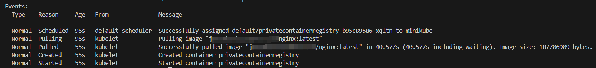

# Scenario: using private container registry in helm chart
In symphony context, instead of creating the image pull secret in the helm chart and passing the key and password in plain-text, you can pass the password using $secret to the chart values.

## 1. Create username and password secret in k8s
You can create the secrets manually or using secret management tools, like Fortos.
You should be able to see a secret or two like this:
```
apiVersion: v1
data:
  password: XXXXXXXXXXXXXXXX # base64 encoded value
  username: XXXXXXXXXXXXXXXX # base64 encoded value
kind: Secret
metadata:
  creationTimestamp: "2024-09-29T06:12:32Z"
  name: my-secret
  namespace: default
  resourceVersion: "1226849"
  uid: 4160bd1e-d245-4ea7-9ca3-690933e28aa5
type: Opaque
```
## 2. Create symphony resources to do the deployment
### Create solutioncontainer/solution with $secret
The $secret refers to the kubenetes secret. $secret("SECRETNAME", "FIELDNAME"). And the secret should be in the same namespace as the solution is.
```
apiVersion: solution.symphony/v1
kind: SolutionContainer
metadata:
  name: test-app  
spec:
---
apiVersion: solution.symphony/v1
kind: Solution
metadata: 
  name: test-app-v-version1
spec:
  rootResource: test-app
  components:
  - name: some_chart_name
    properties:
      chart:
        repo: some_chart_repo
        version: some_chart_version
        name: some_chart_name
      values:
        imagePullSecrets:
            name: repo1secret
            username: "${{$secret('my-secret', 'username')}}"
            password: "${{$secret('my-secret', 'password')}}"
            repo: <PlaceHolder>
    type: helm.v3
```
### Create helm target resource
```
apiVersion: fabric.symphony/v1
kind: Target
metadata:
  name: test-target
  annotations: {}
spec:
  displayName: test-target
  scope: default
  topologies:
  - bindings:
    - config:
        inCluster: "true"
      provider: providers.target.helm
      role: helm.v3
```

### Create the instance deployment -- make sure to have helm chart, solution and target ready before deploy the instance.
```
apiVersion: solution.symphony/v1
kind: Instance
metadata:
  annotations: {}
  name: test-instance
spec:
  displayName: test-instance
  scope: default
  solution: test-app:version1
  target:
    name: test-target
```

## 3. Construct the helm chart
Inside the chart, there would be a secret yaml to create the image pulling secret:
```
apiVersion: v1
kind: Secret
metadata:
  name: {{ .Values.imagePullSecrets.name }}
type: kubernetes.io/dockerconfigjson
data:
  .dockerconfigjson: {{ printf "{\"auths\":{\"%s\":{\"username\":\"%s\",\"password\":\"%s\",\"auth\":\"%s\"}}}" .Values.imagePullSecrets.repo .Values.imagePullSecrets.username .Values.imagePullSecrets.password (printf "%s:%s" .Values.imagePullSecrets.username .Values.imagePullSecrets.password | b64enc) | b64enc | quote }}
```
The .dockerconfigjson has a format like this:
```
'{"auths":{"https://index.docker.io/v1/":{"username":"<USERNAME>","password":"<PASSWORD>","email":"<EMAIL>","auth":"<USERNAME>:<PASSWORD>(base64)"}}}'
```
Email is optional

With this imagePullingSecret, you can create a deployment spec pulling images from the private container registry
```
apiVersion: apps/v1
kind: Deployment
metadata:
  name: {{ .Release.Name }}
  labels:
    app: {{ .Chart.Name }}
spec:
  replicas: {{ .Values.replicaCount }}
  selector:
    matchLabels:
      app: {{ .Chart.Name }}
  template:
    metadata:
      labels:
        app: {{ .Chart.Name }}
    spec:
      imagePullSecrets:
        - name: {{ .Values.imagePullSecrets.name }}
      containers:
        - name: {{ .Chart.Name }}
          image: "{{ .Values.image.repository }}:{{ .Values.image.tag }}"
          ports:
            - name: http
              containerPort: 80
              protocol: TCP
```

You can find a sample chart here:  
[sample-chart Chart.yaml](../../samples/privateContainerRegistry/helm/Chart.yaml)

## 4. Verification
First you need to verify the instance:
```
kubectl get instance test-instance -o yaml
```
You should see .status.provisioningStatus.status is Succeeded

Then you can see the pod created by the helm chart:
```
kubectl get pods
```
There should be a record starting with privatecontainerregistry.

Finally, you can check if the image pulling from the private container registry succeeds or not:
```
kubectl get pod privatecontainerregistry-xxx-xxx
```
