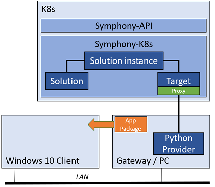

# Scenario: Deploy a Linux container with a UWP frontend

In this scenario, you deploy a **solution** with a Linux container backend running on a Linux **target** and a UWP frontend running on a Windows 10 machine.



## Prerequisites

* A Windows 10 client machine
* A Windows gateway machine, which can be another Windows 10 machine. It can also be the same machine as your target Windows 10 machine. You'll run a Python version provider on this machine.
* Windows SDK 1803 or higher installed on the gateway machine.
* Visual Studio 2022 for building the sample UWP app package.
* Python 3.10 or higher.

## 1. Prepare the UWP application package

You can use any UWP application package of your choice. The signing certificate must be trusted on the target machine.

Or, you can build the sample **Home Hub** UWP app from this repository. You can find the Visual Studio solution under the `samples/scenarios/homehub/uwp-app` folder. Simply open the solution and rebuild the application package. Note you may need to switch to your own signing certificate.

Once the package is created, you should have something like `HomeHub.Package_1.0.x.0_x64_Debug.appxbundle` under the build directory. When you configure your Python provider, you need to enter this path to your Python code.

## 2. Prepare the Python provider

You can find the source code of the sample Python provider under the `samples/scenario/homehub/python-provider` folder. Before launching it, update the `winappinstall.py` file and change the `WINAPPINSTALL` constant and the `TARGET_IP` constant to match with your environment.

Once the file is changed, launch the provider with Python:

```cmd
py winappinstall.py
```

## 3. Define the target

Your target definition should have a proxy provider enabled. The `serverUrl` should be pointing to the gateway machine where you are running the Python provider:

```yaml
apiVersion: fabric.symphony/v1
kind: Target
metadata:
  name: mac-book
spec:
  topologies:
  - bindings:
    - role: instance
      provider: providers.target.k8s
      config:
        inCluster: "true"
    - role: win.uwp
      provider: providers.target.proxy
      config:
        name: proxy
        serverUrl: "http://<your gateway where Python provider is running>:8090/"
```

## 4. Define the solution

The following solution defines a nginx container and a UWP app. The `app.package.pth` should point to the full path to the`appxbundle` file.

```yaml
apiVersion: solution.symphony/v1
kind: Solution
metadata:
  name: home-hub
spec:
  components:
  - name: backend
    type: container
    properties:
      container.image: "nginx"
  - name: HomeHub_1.0.7.0_x64
    type: win.uwp
    properties:
      app.package.path: "E:\\HomeHub.Package_1.0.7.0_Debug_Test\\HomeHub.Package_1.0.7.0_x64_Debug.appxbundle"
```

## 5. Define the instance

The instance simply maps the solution to your target. Note that the Windows 10 target is not explicitly specified as it's proxied.

```yaml
apiVersion: solution.symphony/v1
kind: Instance
metadata:
  name: homehub-instance
spec:
  solution: home-hub
  target:
    name: mac-book
```

## 6. Deploy

```bash
kubectl create -f mac-target.yaml
kubectl create -f homehub-app.yaml
kubectl create -f homehub-instance.yaml
```

Observe the app getting deployed to the target Windows 10 machine.

## 7. Remove the instance

```bash
kubectl delete instance homehub-instance
```

Observe the app is removed from the target Windows 10 machine.

## 8. Clean up

```bash
kubectl delete solution home-hub
kubectl delete target mac-book
```