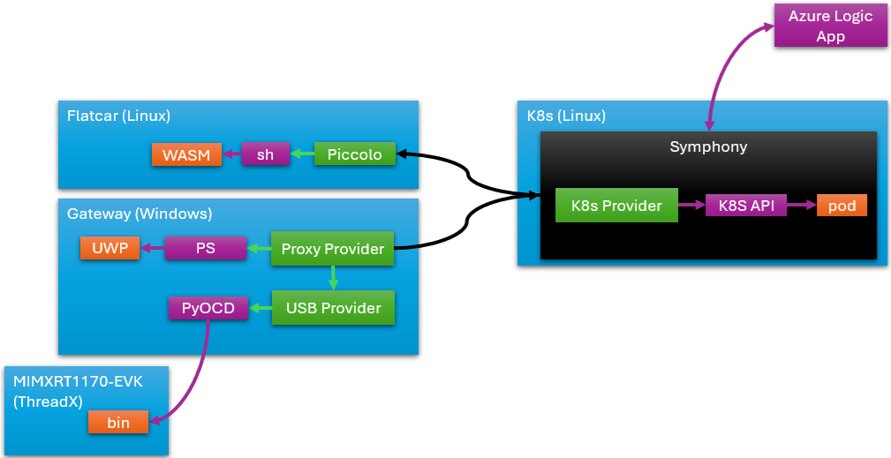

# Multi-OS deployment

_(last update: 2/24/2024)_

This scenario deploys an application that spans Kubernetes, Windows, bare-metal Linux and RTOS. The application simulates a smart appliance that has a backend service, a Windows-based frontend, a driver on an ECU as well as a library on an RTOS device. This scenario can also be considered as a simplified SDV system, where core services run on a HPC cluster, an infotainment system runs on a consumer-facing OS like Android or Windows, and some device drivers run on ECUs.

## Generic flow

1. Define your application as a Symphony `solution` object. This object contains four components: a Docker container that is to be deployed on Kubernetes, an UWP application package that is to be deployed to Windows, a Web Assembly module that is to be deployed on a Flatcar VM, and a ThreadX binary image that is to be deployed on a MIMXRT1170-EVK board.
2. Define four deployment `target`s: Kubernetes cluster, Windows machine, Flatcar VM and RTOS.    
    In this scenario, the Windows machine is managed by a [MQTT proxy provider](../providers/mqtt_proxy_provider.md) deployed on the Windows machine.
3. Define an `instance` object that maps the above three components to corresponding targets.
4. [OPTIONAL] Define a `campaign` that describes a worfklow. This workflow asks for a user's approval (via email) to inject an eBPF module to the Flatcar system during a specific time window for network profiling.
5. [OPTIONAL] Defines an `activation` object that activates the above workflow.

## Sample artifacts
You can find sample artifacts in this repository under the `docs/samples/multi-os` folder:
| Artifact | Purpose |
|--------|--------|

## Build sample packages

### Build UWP sample app
1. Open `docs/samples/scenarios/homehub/uwp-app/HomeHub.sln` with Visual Studio 2022.
2. Build the solution for `x64` architecture, `Debug` profile.
3. Copy the `HomeHub.Package/AppPackages/HomeHub.Package_1.0.9.0_Debug_Test` folder to a folder that is accessible by the proxy provider (see below).

### Setup proxy provider on Windows
1. Create a new folder on your Windows machine.
2. Copy the `sdks/python-sdk` folder to the above folder.
3. Copy the `docs/samples/scenarios/homehub/python-provider/winappinstall.py` to the `python-sdk` folder above.
4. Under the `sdks/python-sdk` folder in step 2, run `pip install -r requirements.txt` to install required depedencies.
5. Update `winappinstall.py` to make sure `WINAPPINSTALL` points to the `WinAppDeployCmd.exe` executable from Windows SDK, and `TARGET_IP` points to the Window machine's IP address.
    > **NOTE**: You can operate another Windows box through the IP given you have sufficient access.
6. Launch the proxy provider: `py .\winappinstall.py`.

