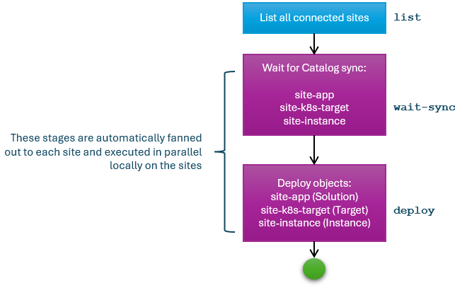

# Multi-site deployment

In this scenario, you roll out a new application from your HQ office to multiple field offices. From the HQ, you can design the application structure as well as its deployment topology you’d like to see on each of the connected sites. Once the application is deployed, it’s operated by the local Symphony control plane without needing to maintain a connection back to HQ (while statuses can be aggregated back to HQ for a wholistic view).

## Generic flow

1. Define your application structure as a `catalog` object that contains Symphony `solution` definition.
2. Define your application deployment topology as a `catalog` object that contains a Symphony `instance` definition.
3. (Optionally) Define deployment targets as a `catalog` object that contains a Symphony `target` definition.
4. Define and activate a `campaign` that drives multi-site deployment from the HQ.

## Sample artifacts

You can find sample artifacts in this repository under the `docs/samples/multisite` folder:

| Artifact | Purpose |
|--------|--------|
| [instance-catalog.yaml](../../samples/multisite/instance-catalog.yaml) | Instance definition (wrapped in a catalog) |
| [solution-catalog.yaml](../../samples/multisite/solution-catalog.yaml) | Solution definition (wrapped in a catalog) |
| [target-catalog.yaml](../../samples/multisite/target-catalog.yaml) | Target definition (wrapped in a catalog) |

The following diagram illustrates how the stages in the multi-site deployment workflow are defined, with corresponding stage names in `campaign.yaml`.



> **NOTE**: The `wait-sync` stage and the `deploy` stage are automatically fanned out to all connected sites because they have an associated `contexts` attribute, which serves as a replicator of a stage. And these stages are handled by a `providers.stage.remote` provider that delegates stage execution to a remote site.

## Deployment steps

1. On HQ site, create all catalog objects:

   ```bash
   # make sure kubectl context is set to HQ
   kubectl apply -f solution-catalog.yaml
   kubectl apply -f instance-catalog.yaml
   kubectl apply -f target-catalog.yaml
   ```

2. Also on HQ site, define and activate the multi-site deployment campaign:

   ```bash
   # make sure kubectl context is set to HQ
   kubectl apply -f campaign.yaml
   kubectl apply -f activation.yaml
   ```

3. Examine what's happening on the site. First, you should see that all catalogs are synchronized to the site (with `hq-` prefixes added):

   ```bash
   # make sure kubectl context is set to the site
   kubectl get catalog
   NAME                       AGE
   hq-site-app                7m38s
   hq-site-instance           7m38s
   hq-site-k8s-target         7m38s
   ```

   In a few minutes, you should also see that the corresponding solution, target, and instance objects are created:

   ```bash
   # make sure kubectl context is set to the site
   kubectl get solution
   NAME             AGE
   site-app         3m51s

   kubectl get target
   NAME                    STATUS
   site-k8s-target         Succeeded

   kubectl get instance
   NAME                  STATUS      TARGETS   DEPLOYED
   site-instance         Succeeded   1         1
   ```

   It may take a few minutes for the instance to become healthy

4. And finally, you should see that the application pod and service are deployed:

   ```bash
   kubectl get svc
   NAME    TYPE           CLUSTER-IP       EXTERNAL-IP   PORT(S)         AGE
   ...
   web-app LoadBalancer   10.109.206.245   <pending>     3011:30440/TCP  5m17s
   ...

   kubectl get pods
   NAME                       READY   STATUS   RESTARTS   AGE
   ...
   web-app-75b4cc94b5-9g2zk   1/1     Running  0          5m28s
   ...
   ```
