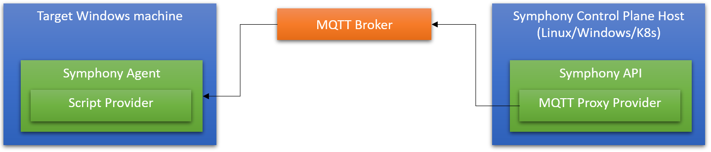

# Remote PowerShell deployment over MQTT

In this scenario, you ensure that a specific process is running on a remote Windows target machine, which is connected to the Symphony control plane over MQTT.



In this scenario, you will:

* Set up an MQTT broker, a Symphony control plane (running on Linux/Windows/Cloud, for instance), and a Windows target machine.
* Submit a [target](../concepts/unified-object-model/target.md) definition to the Symphony control plane using its REST API. The Target specifies that a process called `notepad`  should be running on the target machine. This desired state is forwarded to the target Windows machine over MQTT. 
* Configure a script provider on the target machine to perform the state seeking operations to ensure that `notepad` is running.

Although this scenario is designed for a distributed environment, for simplicity we'll set up everything on a single Windows machine.

## 1. Prepare a Windows target machine

1. Create a `c:\\demo` folder and a `c:\\demo\\staging` folder on your Windows machine.

2. Build the `symphony-api.exe`:

   ```bash
   # under the api folder of the repository
   go build -o symphony-api
   GOOS=windows GOARCH=amd64 go build -o symphony-api.exe
   ```

   For details on how to set up the build environment, see [build instructions](../build_deployment/build.md).

3. Copy `symphony-api.exe` to the `c:\\demo` folder. The Symphony agent and Symphony API share the same binary, driven by different configuration files, which you'll copy next.

4. Copy the `symphony-powershell-over-mqtt.json` file under the `api` repo folder to the `c:\\demo` folder. This is the configuration file that you'll use to launch the Symphony agent. In a production environment, the Symphony agent can be configured as a Windows service that is automatically launched upon start.

5. Copy the `symphony-api-no-k8s.json` file under the `api` repo folder to the `c:\\demo` folder. This is the configuration file that you'll use to launch the Symphony API. In a production environment, the Symphony API is likely to be deployed on a Kubernetes cluster such as ASK. For more information, see [build and deploy](../build_deployment/_overview.md) for more details.

6. Copy the following PowerShell scripts from the `api/docs/samples/script-provider/` repo folder to the `c:\\demo` folder:

   * `get-notepad.ps1`
   * `mock-needsupdate.ps1`
   * `run-notepad.ps1`

   These scripts will be used by the script provider to perform state seeking on the Windows machine.

## 2. Set up an MQTT broker

For testing purposes, set up a local MQTT broker using [Eclipse mosquitto Docker container](https://hub.docker.com/_/eclipse-mosquitto/) under the WSL system on the Windows machine.

1. Under WSL, create a mosquitto config file named `mosquitto.conf` with the following content:

   ```conf
   listener 1883
   allow_anonymous true
   persistence true
   persistence_location /mosquitto/data/
   log_dest file /mosquitto/log/mosquitto.log
   ```

2. Launch mosquitto using Docker:

   ```bash
   sudo docker run -it -p 1883:1883 -p 9001:9001 -v <full path to the above mosquitto.conf file>:/mosquitto/config/mosquitto.conf  eclipse-mosquitto
   ```

3. Optionally, download mosquitto clients and test the broker:

   ```bash
   # Install mosquitto clients
   sudo apt update
   sudo apt install mosquitto-clients
   # Launch subscriber
   mosquitto_sub -h localhost -t house/hub1
   # In a separate terminal window, send a test message
   mosquitto_pub -h localhost -m "this is a test" -t house/hub1
   # message should be received by the subscriber
   ```

## 3. Launch the Symphony API

In this demo scenario, we'll run Symphony API in standalone mode outside of Kubernetes.

1. In a Windows Command Prompt window, navigate to `c:\\demo`.
2. Launch Symphony API:

   ```bash
   symphony-api.exe -c symphony-api-no-k8s.json -l Debug
   ```

## 4. Launch the Symphony Agent

Also under the `c:\\demo` folder, launch the Symphony agent:

```bash
symphony-api.exe -c symphony-powershell-over-mqtt.json -l Debug
```

## 5. Define the Windows target

Now, you are ready to submit a [target](../concepts/unified-object-model/target.md) definition to Symphony.

1. Log in to the Symphony API.

   Use a web client like [Postman](https://www.postman.com/) to send the following request:

   * **Address**: http://localhost:8082/v1alpha2/users/auth
   * **Method**: POST
   * **Body**(json):

     ```json
     {
       "username": "admin",
       "password": ""
     }
     ```

   > **NOTE**: `symphony-api-no-k8s.json` loads a built-in username/password-based IdP with configurable identities in the configuration file. One of the configured identities is `admin` without a password. This is for testing only.

   The above request should return a JSON payload like this:

   ```json
   {
     "accessToken": "eyJhbG...o",
     "tokenType": "Bearer"
   }
   ```

   Copy the `acccessToken`, which you need to attach as a bearer token in subsequent requests.

2. Submit the target definition.

   Send the following request:
   * **Address**: http://localhost:8082/v1alpha2/targets/registry/win-target
   * **Method**: POST
   * **Header**: `Authorization = Bearer <accessToken>`
   * **Body**(json):

     ```json
     {
       "components": [
         {
           "name": "notepad",
           "type": "notepad",
           "properties": {
             "state": "running",
             "app.package": "notepad"
           }
         }
       ],
       "topologies": [
         {
           "bindings": [
             {
               "role": "notepad",
               "provider" : "providers.target.mqtt",
               "config": {
                 "brokerAddress": "tcp://localhost:1883",
                 "clientID": "control-plane",
                 "requestTopic": "symphony-request",
                 "responseTopic": "symphony-response"
               }
             }
           ]
         }
       ]
     }
     ```

The target definition JSON file defines a target (note the target name, `win-target`, is in the query path) that has a `notepad` component. It also defines the target (component) topology and says, "for the notepad typed component, use a `providers.target.mqtt` provider to handle all state seeking needs". The MQTT provider is configured to use the local MQTT provider tht you launched in step 2.

When Symphony sees this target definition, it creates a target object and generates a deployment based on the component definition on the target. For each of the components, a provider is chosen to carry out state seeking. In this case, the MQTT provider is chosen and invoked when Symphony tries to check/reconcile state.

The state seeking request from Symphony will be published to the designated MQTT topic (`symphony-request`). These requests will be picked up by the Symphony agent that you launched in step 4. The agent looks at its own provider configurations and uses the `providers.target.script` provider to perform state seeking.

In a few seconds, you should see a notepad launched on your machine. And if you close it, it will be relaunched after a few seconds during the next round of state reconciliation.

This simulates the scenario that you have a desired state ("notepad is running") on the target machine, and Symphony periodically reconciles the machine state to make sure the desired state is met.

## 6. Shut down

To stop the demo, shut down both the API process and the agent process. By default, they are both configured to use in-memory state, so no additional cleanup is needed. To repeat the demo, relaunch the processes and re-send the requests.

## Known limitations

* Removal script is not implemented in this demo.
* Mosquitto is configured to serve local requests only. If you need a distributed system, you need to configure an MQTT broker that is reachable from both machines. For instance, if you are deploying Symphony API on AKS, you can set up a MQTT service on the same AKS cluster and expose the broker via a public IP.
