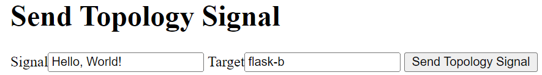

# Solution visualization 

In this scenario, you’ll deploy an application with two Flask app components: `flask-a` and `flask-b`. The `flask-a` component has a solution visualization sidecar enabled. It can invoke the side car at any moment to send a piece of topology information, such as "flask-a sends data to `flask-b". The topology information is assembled on Symphony. And when queried, Symphony can present a live view of the solution topology, with ability to preview data packets on the wire. 

## Generic flow
1. For components that you want to collect topology information, define a visualization sidecar along with the component container.
2. A component can proactively call the sidecar to send a piece of topology information, such as “I send data to component b”, with an optional sample data packet.
    > **NOTE**: a future sidecar may be configured to automatically intercept network traffic.
3. All the topology information pieces are collected in Symphony as Catalogs, which are assembled to a topology graph when queried.
4. The solution topology graph can be presented on a UI; if sample data packets are available, the UI can present data packet previews as well.

## Sample artifacts
You can find sample artifacts in this repository under the `docs/samples/k8s/solution-visualization` folder:
| Artifact | Purpose |
|--------|--------|
| [instance.yaml](../../samples/k8s/solution-visualization/instance.yaml) | Instance definition |
| [solution.yaml](../../samples/k8s/solution-visualization/solution.yaml) | Solution definition |
| [target.yaml](../../samples/k8s/solution-visualization/target.yaml) | Target definition |

## Required container images
This sample uses a few pre-built sample container images. You can use the following image directly from Symphony's container registry. Or you can build your own from the source:

* **Sample visualization sidecar**
  
    Pre-built image: `hbai/visualization-sidecar:latest`

    Build from source: (under repo root folder)
    ```bash
    cd api
    go build -o symphony-api
    cd ..
    docker build -t <sidecar image tag> -f api/Dockerfile.sidecar .
    ```
* **Sample Flask app**

    Pre-built image: `hbai/sample-flask-app:latest`

    Build from source: (under repo root folder)
    ```bash
    cd docs/samples/sample-payload-flask
    docker build -t <flas app image tag> .
    ```
## Deployment steps
1. Update `solution.yaml` to use Docker images from your selected repository.

2. Create Symphony objects:
    ```bash
    kubectl apply -f solution.yaml
    kubectl apply -f target.yaml
    kubectl apply -f instance.yaml     
    ```
    > **NOTE**: When you use your current Kubernetes cluster as the target, make sure you don't register the same cluster multiple times (as different targets).

3. Once `flask-a` service is running, user a browser to navigate to `http://<flask-a service IP>:5000`. 

    > **NOTE:** If you are using minikube locally, you need to use `kubectl port-forward` to enable access to the service.
4. On the sample web page, scroll down to the **Send Topology Signal** section. Enter a text message in the **Signal** field and a target component name in the **Target** field. Then, click on the **Send Topology Signal** button.
    

    > **NOTE:** In this case, the sample sidecar is passive. This means an app needs to proactively calls its endpoint to send topology information. In theory, a different sidecar implemenation can attempt to automatically intercept network and send topology information.

5. Observe the `catalog` that gets populated in Symphony:
    ```bash
    kubectl get catalog

    NAME                                     AGE
    sample-visualization-solution-topology   13m
    ```

    This catalog contains the topology information collected by the visualization sidecar, such as:
    ```yaml
    properties:
    flask-a:
      flask-b:
        data: Hello, World!!!!!
        from: flask-a
        solution: sample-visualization-solution
        to: flask-b
    ```

    A UX can use this information to build up the live solution topology view.