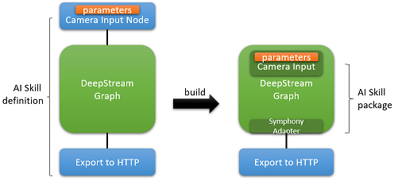
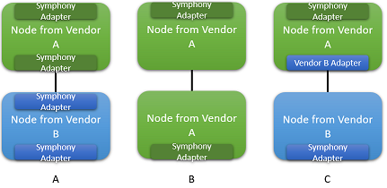

# AI Skill Management

Symphony’s AI Skill object is a generic graph definition with edges and nodes. The goal of this graph is not to replace existing AI graphs. Instead, It’s specifically aimed at creating a “super graph” that spans across multiple graphs from different platforms. Within this “super graph”, a graph from a specific AI framework can be treated as a single node, such as a DeepStream node. Symphony’s “super graph” augment that graph with:

* Consistent parameter handling
* Standardized camera discovery and auto-configuration
* Normalized import/export nodes and connectivity to business logic

The following diagram illustrates a sample integration with a DeepStream graph. To the left, the [AI skill](../uom/ai-skill.md) definition contains a camera input node, a DeepStream graph node, and an export node. This AI skill is then packaged into an [AI skill package](../uom/ai-skill-package.md) through a builder. The builder translates Symphony camera definition, along with any user specified parameters, into DeepStream native format. And there's a Symphony adapter on the other end to translate DeepStream output to Symphony format and feed the output to Symphony output node.

This design allows AI vendors to bring in their AI graphs as a [AI skill node](../uom/ai-skill-node.md) of a Symphony AI skill graph. The above example shows the entire graph being encapsulated as a single node. However, a vendor can also choose to supply individual nodes at finer granularity. Symphony builder will insert adapters as needed to allow nodes from different vendors to communicate with each other when possible (configuration A). And the adapters are skipped among nodes from the same vendor to minimize overhead (configuration B). Finally, specialized vendor-to-vendor adapters are also allowed (configuration C).

