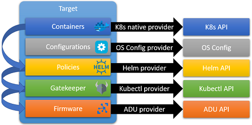

# Target Management
A ```Target``` in Symphony is an endpoint to which Symphony ```Components``` can be deployed. An ```Target``` can be a server, a PC, a mobile device, a cluster, or simply a service endpoint. When a ```Target``` is registered, Symphony allows a **full-stack description of all software components, policies and configurations** that are required on the target, and Symphony uses its state-seeking mechanism to make sure the target is configured properly.


## Components
You can define the full software stack on a ```Target``` by adding software artifacts to its ```Components``` collection. Each component can use a different artifact format and is handled by a different provider. For example, you can embed a Kubernetes Yaml file as a component and uses a Kubernetes native provider to install it.
Each component can have one or multiple dependencies. Symphony sorts the dependency graph by topological order and ensures the components are installed in the correct order.
For example, the following components collection defines three components: symphony-agent, polices and gatekeeper. Symphony-agent relies on both policies and gatekeeper, and policies relies on gatekeeper. This makes gatekeeper the first component to be installed, while the symphony-agent being the last.
```yaml
components:
  - name: "symphony-agent"
    properties:
      ...
    dependencies:
    - gatekeeper
    - policies
  - name: "gatekeeper"
    type: yaml.k8s
    properties:
      ...    
  - name: "policies"
    type: yaml.k8s
properties:
  ...
    dependencies:
    - gatekeeper
```
## Role bindings
A component is bound to a [provider](../providers/target_provider.md) through a role binding by component type. For example, the following binding binds a ```yaml.k8s``` component type to a ```providers.target.kubectl``` provider.
```yaml
  topologies:
  - bindings:
    - role: yaml.k8s
      provider: providers.target.kubectl
      config:
        inCluster: "true"
```
