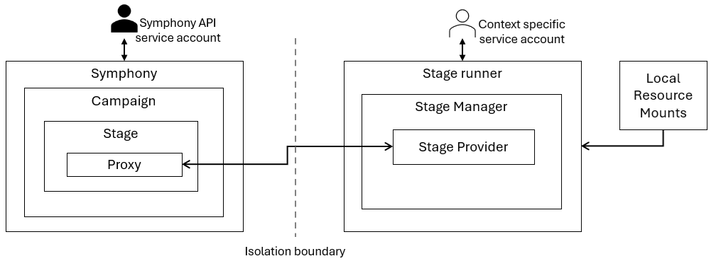

# Stage Isolation With Provider Proxy

By default, all stage providers are invoked as in-proc calls on the Symphony control plane. This means all stage providers use the same service account context configured for the Symphony API. As the control plane often needs to manage a large number of resources, having a super user with access to all resources is an obvious security concern. A stage provider proxy allows a stage to be processed in an isolated environment such as a separate process, container, virtual machine, or physical device. The stage provider proxy expects a web server or a MQTT client application (called a **stage runner**) that implements the required Symphony stage provider interface. Although you can implement your own stage runner, we recommend using the default Symphony implementation, which supports all existing Symphony stage providers over the proxy.

Such isolation has some distinct benefits:

* Support different execution environments. As a stage runner can be hosted independently from the control plane, the stage runner can be configured with the exact toolchains for the specific stages. For example, a containerized stage runner can have all necessary tools pre-installed. Another example is that a Windows-based stage runner can use Windows toolchains.
* Because a stage runner runs in a different process, you can assign just enough access rights to the process to perform stage activities. 
* The isolation also provides certain protection over rogue provider implementations, such as script-based attacks.
* Resources required by the runner can be mounted locally without needing to be shared with the control plane.

The following diagram illustrates how stage isolation works with the provider proxy and a stage runner:



## Declaring stage proxy

You can attach a proxy setting to any of the stage specs. For example, the following stage spec specifies that the mock stage should be carried out remotely through an HTTP processor proxy:

```yaml
stages:
  mock:
    name: mock
    provider: providers.stage.mock
    proxy:
      provider: providers.stage.proxy.http
      config:
        baseUrl: http://localhost:9082/v1alpha2/
        user: admin
        password: ""        
```

Similarly, you can use a MQTT processor proxy to delegate any stage to a remote processor through MQTT messaging. The following example also shows that you can configure the stage just as before. In this case, a script provider is configured. Note that the `scriptFolder` is relative to where the processor process is running. This means in the case of distributed script execution, you don't have to submit the script to the Symphony control plane or cloud. Instead, you can keep the scripts locally in your execution enviornment. On the other hand, if you do want to manage scripts in a centralized location, you can specify a URL in the `scriptFolder` property and scripts will be downloaded from the designated URL.
```yaml
stages:
  mock:
    name: mock
    provider: providers.stage.script
    config:
      scriptFolder: "."
      scriptEngine: "bash"
      script: "my-processor.sh"
    proxy:
      provider: providers.stage.proxy.mqtt
      config:
        brokerAddress: "tcp://localhost:1883"
        requestTopic: "test-request"
        responseTopic: "test-response"
        timeoutSeconds: 5
        keepAliveSeconds: 2
        pingTimeoutSeconds: 1        
```

## Launch a stage runner using Symphony API binary

You can start a stage runner by running the `symphony-api` process with an appropriate configuration file. In the `api` folder, we provide two sample configuration files: `symphony-stage-runner-http.json`, which launches a stage runner over HTTP, and `symphony-stage-runner-mqtt.json`, which launches a stage runner over MQTT. For example, to launch a stage processor over HTTP, use:
```bash
# under the api folder, after building symphony-api using go build -o symphony-api
./symphony-api -c ./symphony-stage-runner-http.json -l Debug
```
> **NOTE**: You'll need to modify your [binding](../bindings/_overview.md) settings to match with your environment before using the configuration file. 
