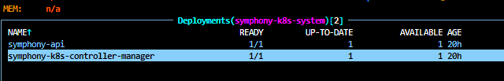
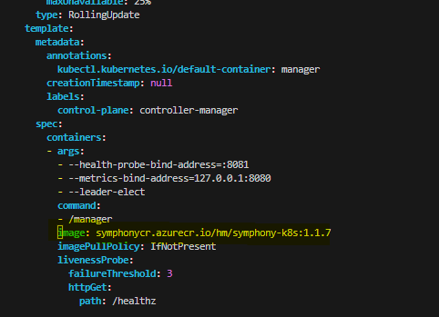

# Dev Guide for Symphony-k8s

Subject to Change as better practices are discovered

There are a few routes to take when developing in Symphony-K8s
* Route 1 - Only Updating Operator code (controllers, makefile, things outside of the CRDs)
* Route 2 - Updating CRDs

Depending on what you're updating you will end up taking one of these two routes.

> **Note** This guide is deprecated. The recommended way to do local development now is with localenv. See [localenv](../localenv/README.md) for more information.
> To setup a local env with minikube run the following
>```bash
># k8s directory
>mage helmTemplate
># localenv directory
>mage minikube:install # this will install minikube
>mage minikube:start # this will start minikube
>mage build # this will build the docker image for symphony-k8s and symphony-api
>mage load # this will load the built images into the minikube cluster
>mage deploy # this will install the symphony local helmchart
>```
Also included is info about the [Symphony Postman Collection](https://solar-shadow-224876.postman.co/workspace/DH-RP-work~774dd7e8-e45a-49fb-9feb-704dd4b67da0/collection/19948895-8ab52868-7d43-4502-a75e-6efc2d7992a4) at the bottom.

## Route 1: Updating Operator Code
Updating the operator code is straight forward, if you are not seeing changes reflected in the `config/crd/bases` directory, you are most likely only changing the operator code.
### 1.1 Build Docker Image
```bash
docker-compose build
```
For now we are developing in the symphonycr acr. You would build the image in your own custom repository there.

### 1.2 Push Docker Image
```bash
docker push symphonycr.azurecr.io/<your-repo>:<number>
```
You can update the deployment of `symphony-k8s-controller-manager` with your new image right away if you have an instance of symphony running






After the change is made you can delete the symphony-k8s-controller-manager pod and it will reset to point at that image


### 1.3 [Optional] Install Symphony Helm Chart 

If you would like to start with a fresh cluster and test out the arc-extension you can run the script provided in the symphony-extension directory `symphony-extension-setup.sh`. Doing this step requires you to also set up resource sync rules in the [symphony postman collection](https://solar-shadow-224876.postman.co/workspace/DH-RP-work~774dd7e8-e45a-49fb-9feb-704dd4b67da0/collection/19948895-8ab52868-7d43-4502-a75e-6efc2d7992a4) for full resource hydration.


However if you are just interested in installing symphony not as an arc-extension, you can just install it directly from the repo. Assuming you're in the root of the symphony-k8s directory you can run
```bash
cd ../symphony-extension/helm/
helm install symphony symphony/
```

## Route 2: Updating CRDs
This route will be very similar to the previous but with some additional steps.
### 2.1 Update the types 
If you're interested in updating the CRDs directly that will have to be done through updating the types under `k8s/apis/*`, since the CRDs are auto generated with kubebuilder.
### 2.2 Generate the CRDs
This step will convert the types defined inside `k8s/apis/*` into CRDs and insert them into the directory `k8s/config/crd/bases`
```bash 
mage manifests
```

### 2.3 Update Symphony.yaml 
This step will combine all the generated CRDS from the previous step that live inside `k8s/config/crd/bases/` and insert them into the helm chart of the symphony extension located inside `symphony-extension/helm/symphony-chart`
```bash 
mage helmTemplate
```
if no `IMG=""` parameter is provided with the make helm-template command then it will overwrite the controller manager image with `controller:latest`. You can either provide this parameter or manually update the image inside the deployments when the cluster is running or manually in the symphony.yaml template. Some work needs to be done here to fix this.
### 2.4 Build Docker Image
```bash
docker-compose build 
```
For now we are developing in the symphonycr acr. You would build the image in your own custom repository there.

### 2.5 Push Docker Image
```bash
docker push symphonycr.azurecr.io/<your-repo>:<number>
```
### 2.6 Helm Chart Steps
At this step you have a new helm chart and need to update the existing one. Depending on how you would like to test there are several steps to take.

#### 2.6.1 Only Symphony Helm Chart, Not as an arc-extension
If you are just interested in locally installing symphony with no RP connection you can install symphony directly using
```bash
cd ../symphony-extension/helm/
helm install symphony symphony/
```
assuming you're in the root of symphony-k8s directory
### 2.6.2 Symphony Helm Chart with RP and as an arc-extension
1. Pick a version from [symphonycr/arc-extension](https://ms.portal.azure.com/#view/Microsoft_Azure_ContainerRegistries/RepositoryBlade/id/%2Fsubscriptions%2F77969078-2897-47b0-9143-917252379303%2FresourceGroups%2FSymphony_Shared_RG%2Fproviders%2FMicrosoft.ContainerRegistry%2Fregistries%2Fsymphonycr/repository/arc-extension%2Fsymphony), these are the only versions that are registered through geneva actions to be used as an arc-extension. When picking one be sure you pick one that isn't used by others by pinging in the DH chat to see what others are using. Some work needs to be done to have this process be more streamlined. Such as configuring a dev ACR where the test-arc-extension can use any version within it. **Version to avoid: 0.43.x**
2. Update version in Chart.yaml to be a version you chose from the ACR inside  `symphony-extension/helm/symphony-chart` We are essentially replacing the helm chart at that version. If you would like to have your own version inside this repository let me know and I can help configure that. Below is how to helm package and push to the arc-extension acr.
```bash
cd ../symphony-extension/helm/
az login --use-device-code
az acr login -n symphonycr
helm package symphony/  
helm push <your-package> oci://symphonycr.azurecr.io/arc-extension
```


3. At this point the helm chart you configured is in acr and is under a version that the arc-extension recognizes. To test as an arc-extension you can run the script `symphony-extension-setup.sh` located in the symphony-extension directory. Please include your name or alias and the version you will be working on to the script. 

This will provision a fresh minikube cluster and arc-enable it. Doing this step requires you to also set up resource sync rules in the [symphony postman collection](https://solar-shadow-224876.postman.co/workspace/DH-RP-work~774dd7e8-e45a-49fb-9feb-704dd4b67da0/collection/19948895-8ab52868-7d43-4502-a75e-6efc2d7992a4) for full resource hydration. 


## Postman Collection
Fork the [Symphony Postman Collection](https://solar-shadow-224876.postman.co/workspace/DH-RP-work~774dd7e8-e45a-49fb-9feb-704dd4b67da0/collection/19948895-8ab52868-7d43-4502-a75e-6efc2d7992a4) so that you have your own instance of it.

If you just ran the `symphony-extension-setup.sh` you will need to configure the ResourceSyncRule under `RP Administration` for full resource hydration (Allowing CRs created at K8s level to project up to ARM)

## Directory Breakdown in Postman Collection
### CRUD on Resources
Just as the name implies this directory holds the CRUD operations for the resource types. Within the Symphony directory you can find examples of solution, instance, & target resource creation. Feel free to play around with the resources and payloads. If the desire is to have full resource orchestration make sure the solution and target names specified within the instance payload match with the resources you create.
### RP Administration
This directory is primarily used for registering the resource provider and resource types for RPaaS. Included here is the registrations for all the resource such as solution, targets, instances as well as ARM specific resource type registrations such as operationStatuses for LRO.

