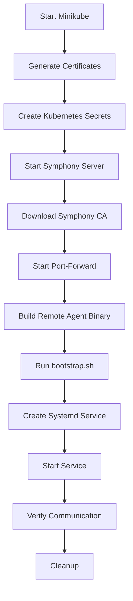

# Bootstrap Testing for Remote Agent E2E Tests

This document explains how to run E2E tests using the bootstrap.sh script to start Remote Agent as a systemd service.

## 🚀 Overview

The bootstrap testing approach uses your existing `bootstrap.sh` script to:
1. Build the Remote Agent binary
2. Create systemd service configuration
3. Start the service using systemd
4. Test end-to-end communication with Symphony

## 📋 Prerequisites

### 1. Sudo Access Configuration
The bootstrap script requires sudo access to create systemd services. Configure passwordless sudo:

```bash
# Add current user to sudoers for automated testing
echo "$USER ALL=(ALL) NOPASSWD: ALL" | sudo tee /etc/sudoers.d/test-automation

# Or configure for specific commands only
echo "$USER ALL=(ALL) NOPASSWD: /bin/systemctl, /usr/bin/tee" | sudo tee /etc/sudoers.d/systemctl-nopasswd
```

### 2. System Dependencies
```bash
# Install required tools
sudo apt-get update
sudo apt-get install -y systemd jq

# Ensure systemctl is available
systemctl --version
```

## 🧪 Running Bootstrap Tests

### HTTP Communication Test
```bash
cd test/e2e/remote-agent-integration

# Run the bootstrap HTTP test
GOWORK=off go test -v -timeout 25m ./scenarios/http-communication/ -run TestE2EHttpCommunicationWithBootstrap
```

### MQTT Communication Test (Future)
```bash
# MQTT bootstrap test (when implemented)
GOWORK=off go test -v -timeout 25m ./scenarios/mqtt-communication/ -run TestE2EMqttCommunicationWithBootstrap
```

## 🔧 How It Works

### 1. Test Flow


### 2. Bootstrap.sh Arguments
The test automatically constructs the correct arguments for your bootstrap.sh script:

**HTTP Mode:**
```bash
./bootstrap.sh http \
  "https://localhost:8081/v1alpha2" \
  "/path/to/client.crt" \
  "/path/to/client.key" \
  "test-target" \
  "test-namespace" \
  "/path/to/topology.json" \
  "$USER" \
  "$GROUP"
```

**MQTT Mode (when implemented):**
```bash
./bootstrap.sh mqtt \
  "localhost" \
  "8883" \
  "/path/to/client.crt" \
  "/path/to/client.key" \
  "test-target" \
  "test-namespace" \
  "/path/to/topology.json" \
  "$USER" \
  "$GROUP" \
  "/path/to/remote-agent" \
  "/path/to/ca.crt" \
  "false"
```

### 3. Systemd Service Management
The test automatically:
- Creates `/etc/systemd/system/remote-agent.service`
- Starts the service with `systemctl start remote-agent.service`
- Monitors service status
- Cleans up on test completion

## 🛠️ Troubleshooting

### Common Issues

1. **Sudo Permission Denied**
   ```bash
   # Error: sudo: a password is required
   # Solution: Configure passwordless sudo (see Prerequisites)
   ```

2. **Systemd Not Available**
   ```bash
   # Error: systemctl: command not found
   # Solution: Install systemd or run in a systemd-enabled environment
   ```

3. **Service Failed to Start**
   ```bash
   # Check service status
   sudo systemctl status remote-agent.service
   
   # View service logs
   sudo journalctl -u remote-agent.service -f
   ```

4. **Binary Build Failed**
   ```bash
   # Error: go build failed
   # Solution: Ensure Go modules are properly configured
   cd remote-agent && go mod tidy
   ```

### Manual Cleanup
If tests are interrupted, clean up manually:

```bash
# Stop and remove service
sudo systemctl stop remote-agent.service
sudo systemctl disable remote-agent.service
sudo rm -f /etc/systemd/system/remote-agent.service
sudo systemctl daemon-reload

# Clean up minikube
minikube delete
```

## 🔍 Test Components

### Key Functions

1. **`StartRemoteAgentWithBootstrap()`**
   - Builds Remote Agent binary
   - Executes bootstrap.sh with correct arguments
   - Manages systemd service lifecycle

2. **`CheckSudoAccess()`**
   - Verifies sudo permissions before starting
   - Skips test if sudo not available

3. **`WaitForSystemdService()`**
   - Monitors service startup
   - Ensures service is active before proceeding

4. **`CleanupSystemdService()`**
   - Stops and removes systemd service
   - Cleans up service files

### Configuration
Test automatically handles:
- User/group detection for systemd service
- Certificate path resolution
- Binary compilation
- Service lifecycle management

## 📊 Benefits

✅ **Production-like Testing** - Uses your actual bootstrap script
✅ **Systemd Integration** - Tests real service deployment
✅ **Automated Management** - No manual intervention required
✅ **Complete Cleanup** - Removes all test artifacts
✅ **Sudo Integration** - Handles privileged operations safely

## 🎯 Next Steps

1. Run the bootstrap test to verify your setup
2. Configure sudo access for automated testing
3. Integrate into CI/CD pipeline
4. Extend for MQTT protocol testing

The bootstrap testing approach gives you confidence that your Remote Agent deployment process works end-to-end in a production-like environment!
